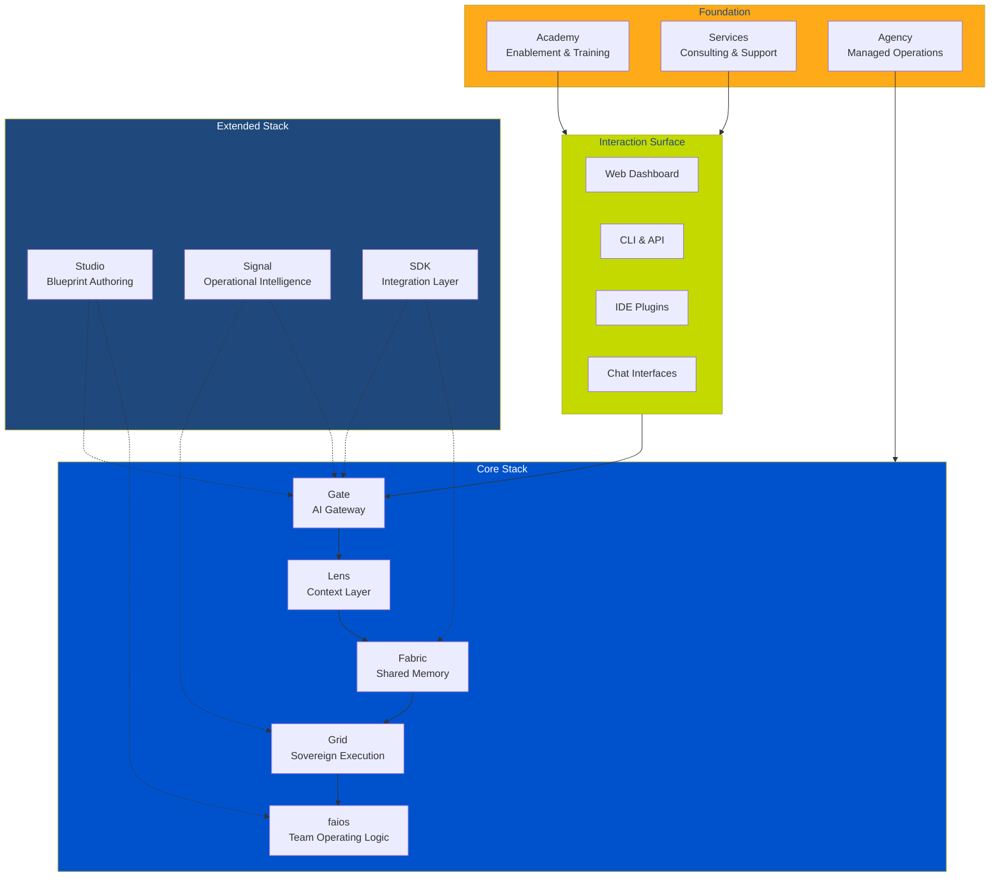
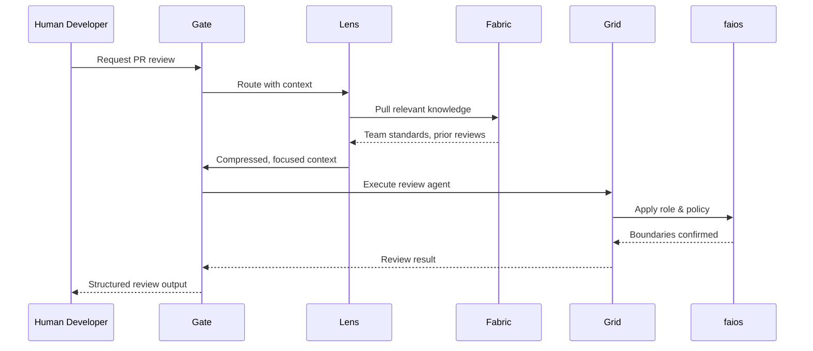

# Platform Overview

The fusionAIze platform is a layered operating system for human-AI fusion teams. Every component serves a single purpose: to make virtual employees feel as natural, trusted, and operationally integrated as human colleagues.

---

## The complete stack

---

## Core stack

The core stack is released under **Apache 2.0** and provides the foundational capabilities every fusion team needs.

### Gate — AI Gateway

`faigate` is the single entry point for all AI interactions. It abstracts every model provider behind a unified interface, handling routing, failover, rate limiting, cost tracking, and access control.

Gate answers the question: **which model should handle this, and what are the boundaries?**

- Multi-provider routing with fallback chains
- Cost governance and budget enforcement
- Access control and audit logging
- Provider-agnostic API surface

[:octicons-arrow-right-24: Gate documentation](../products/gate/index.md)

### Lens — Context Layer

`failens` compresses, focuses, and translates context before it reaches the AI model. It ensures that virtual employees work with exactly the right information — no more, no less.

Lens answers the question: **what does this AI colleague need to know right now?**

- Context window optimisation and compression
- Relevance filtering and priority scoring
- Cross-session context continuity
- Explanation and transparency traces

[:octicons-arrow-right-24: Lens documentation](../products/lens/index.md)

### Fabric — Memory Fabric

`faifabric` is the shared, persistent knowledge layer. It stores what fusion teams learn, decide, and produce — so that every interaction builds on everything that came before.

Fabric answers the question: **what do we collectively know?**

- Semantic memory storage and retrieval
- Episodic memory (session histories, decision logs)
- Knowledge graph with entity extraction
- Cross-team and cross-project sharing

[:octicons-arrow-right-24: Fabric documentation](../products/fabric/index.md)

### Grid — Execution Substrate

`faigrid` is the sovereign runtime where AI agents execute. It enforces boundaries, manages isolation, and ensures that virtual employees operate within the guardrails your organisation defines.

Grid answers the question: **where and how does this AI colleague run?**

- Containerised, sandboxed execution
- Resource isolation and quota management
- On-premise and self-hosted deployment
- Execution audit and replay

[:octicons-arrow-right-24: Grid documentation](../products/grid/index.md)

### faios — Team Operating Logic

`faios` is the layer that defines *how* humans and AIs collaborate. Roles, policies, onboarding protocols, handover procedures, escalation paths — the operational patterns that turn isolated AI calls into a functioning team.

faios answers the question: **how do we work together?**

- Role definitions and identity management
- Policy engine for collaboration rules
- Onboarding and handover protocols
- Escalation and exception handling

[:octicons-arrow-right-24: faios documentation](../products/os/index.md)

---

## Extended stack

The extended stack builds on the core and is released under source-available or proprietary licenses.

### Studio — Blueprint Authoring

`faistudio` is the design environment where you create, test, and refine virtual employee behaviour. Define workflows, train on your organisation's patterns, and validate before deployment.

### Signal — Operational Intelligence

`faisignal` provides real-time visibility into your fusion team — cost trends, quality metrics, anomaly detection, and collaboration analytics. It turns AI operations from a black box into a transparent, manageable function.

### SDK — Integration Layer

`faisdk` provides language-native libraries (Python, TypeScript, Go) to embed fusionAIze capabilities into your existing tools, CI/CD pipelines, and custom applications.

---

## How components work together

A concrete example makes the stack tangible. Consider a virtual employee tasked with reviewing a pull request:

1. **Gate** receives the request, identifies the appropriate model, and enforces access controls.
2. **Lens** compresses the context — only the relevant code, style guides, and past review patterns reach the model.
3. **Fabric** provides persistent memory — the AI colleague remembers team conventions, architecture decisions, and past feedback.
4. **Grid** executes the review in an isolated, auditable environment with resource limits.
5. **faios** applies the defined role — the virtual employee operates with the permissions and responsibilities of a reviewer, not an admin.

This flow repeats for every interaction. The result is an AI colleague that behaves predictably, remembers context, respects boundaries, and integrates into the team's operating rhythm.

---

## Commercial structure

fusionAIze operates through three interconnected pillars:

### Agency

The **fusionAIze Agency** provides managed fusion team operations — we design, deploy, and operate fusion teams on behalf of organisations that want the capability without the operational burden. Think of it as "fusion teams as a service."

### Academy

The **fusionAIze Academy** delivers structured enablement — onboarding playbooks, certification tracks, role-specific training, and a shared vocabulary for human-AI collaboration. The Academy ensures that the *human* side of the fusion equation is as well-prepared as the AI side.

### Services

**Professional Services** support custom integration, enterprise deployment, and organisational change management. From on-premise Grid deployment to bespoke faios policy design, Services handle the projects that require deep expertise.

---

## The fusion team concept

!!! info "What is a fusion team?"

    A **fusion team** is a deliberate, structured collaboration between human professionals and AI-powered virtual employees. It is not a chatbot, not an agent swarm, not a copilot — it's an operating model where AI colleagues have defined roles, persistent memory, operational boundaries, and measurable performance.

A fusion team has:

- **Structure**: defined roles, responsibilities, and collaboration protocols.
- **Memory**: shared knowledge that persists across sessions and builds over time.
- **Boundaries**: execution limits, access controls, and policy enforcement.
- **Culture**: onboarding, training, feedback loops, and continuous improvement.
- **Observability**: visibility into performance, cost, quality, and collaboration health.

The fusionAIze platform is the infrastructure that makes this operating model practical — not for a demo, but for daily work at any scale.

---

[:fontawesome-solid-arrow-right: Open-core model](open-core.md){ .md-button }
[:fontawesome-solid-arrow-right: Get started](../getting-started/index.md){ .md-button }
