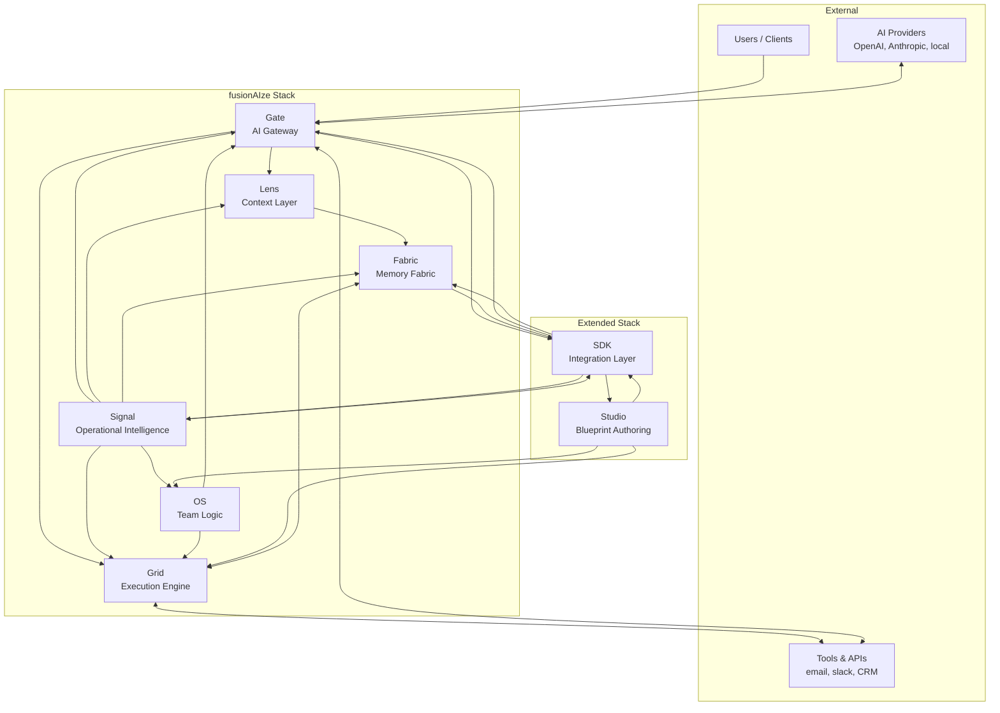
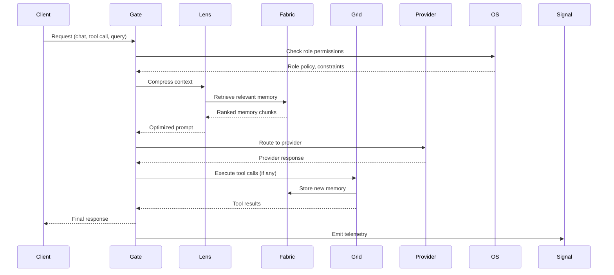
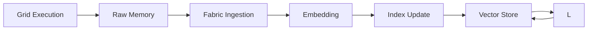
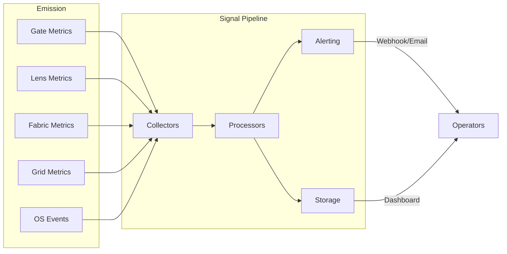

# System Architecture

**How the fusionAIze stack fits together — from model calls to virtual teams.**

---

## Overview

fusionAIze is a **composable, sovereign AI-native platform** for building
and operating human-AI fusion teams. The architecture follows three core
principles:

1. **Separation of concerns** — each component owns exactly one
   responsibility and communicates through well-defined contracts.
2. **Sovereign execution** — all components run on infrastructure you
   control, with no hard dependency on any cloud provider.
3. **Composable by design** — every component works standalone and becomes
   more powerful when combined with others.

---

## High-Level Architecture



---

## Component Responsibilities

### Core Stack

| Component | Responsibility | Runs at |
|-----------|---------------|---------|
| **Gate** | Routes AI requests to providers, enforces policies, handles failover | Edge |
| **Lens** | Compresses, translates, and focuses context to optimize token usage | Between Gate and Fabric |
| **Fabric** | Stores and retrieves shared memory, knowledge, and embeddings | Core |
| **Grid** | Executes virtual employees in isolated sandboxes with tool access | Core |
| **OS** | Manages roles, policies, identities, and team collaboration logic | Core |
| **Signal** | Collects, correlates, and surfaces operational intelligence | Observability layer |

### Extended Stack

| Component | Responsibility | Runs at |
|-----------|---------------|---------|
| **Studio** | Blueprint authoring — design roles, personas, and simulate behavior | Design/Planning |
| **SDK** | Shared client libraries, contracts, and CLI for all components | Integration |

---

## Data Flow Between Components

### The Primary Request Flow

Every external request follows a consistent path through the stack:



### The Memory Lifecycle



1. Virtual employees generate **raw memory** during execution on Grid.
2. Memory is ingested by Fabric, **embedded**, and added to the vector
   index.
3. Lens queries Fabric during context assembly to retrieve **relevant**
   prior memories.
4. Memory is deduplicated and ranked by relevance before being included
   in the prompt context.

### The Observability Flow



---

## Plugin Architecture Principles

The fusionAIze stack uses a **plugin architecture** for extensibility
without sacrificing sovereignty:

### Gate Plugins

```
Gate Core → Plugin Registry → Loaded Plugins
                                   │
                    ┌──────────────┼──────────────┐
                    ▼              ▼              ▼
              Auth Plugin    Routing Plugin   Policy Plugin
              (OAuth, API    (Load-balance,   (Rate-limit,
               key, mTLS)    failover,        quota, audit)
                             provider health)
```

Plugins are **hot-loaded** from a configurable directory at startup. Each
plugin declares its capabilities and dependencies. The Gate core enforces
that every plugin passes through the same authentication and policy
pipeline — there is no bypass.

### Signal Plugins

Signal's collector, processor, alert, storage, and visualization layers are
all plugin-driven (see [Signal Architecture](../products/signal/index.md#architecture)).

### Fabric Backends

Fabric supports pluggable storage backends:

| Backend | Use Case | Maturity |
|---------|----------|----------|
| ChromaDB | Single-machine, zero-config | Production |
| Qdrant | High-performance, filtered search | Beta |
| PostgreSQL + pgvector | SQL-native, self-hosted | Alpha |
| LanceDB | Embedded, file-based | Planned |

### Grid Runtimes

Grid supports multiple isolation runtimes:

| Runtime | Isolation Level | Overhead |
|---------|----------------|----------|
| Docker container | Strong (process + network) | Moderate |
| Firecracker microVM | Stronger (kernel-level) | Higher |
| Native process | None (fastest) | Minimal |
| Kubernetes pod | Strong (namespace) | Moderate |

---

## Design Decisions Summary

| Decision | Rationale | Trade-off |
|----------|-----------|-----------|
| **Components are standalone** | You can run just Gate, just Fabric, or the full stack | Some cross-component features require multiple services |
| **Contracts over direct calls** | All inter-component communication goes through typed contracts (OpenAPI, gRPC, or message queues) | Slightly higher latency for strongly typed boundaries |
| **Plugin architecture** | Extensibility without forking or patching core | Plugin API stability guarantees required |
| **Sovereign-first** | Everything runs on your infrastructure; SaaS is optional, not required | Setup complexity higher than fully managed |
| **TypeScript + Python parity** | SDK and client tools available in both ecosystems | Double maintenance for contract generation |
| **Deterministic alerts** | Signal uses rule-based alerting before introducing ML-based anomaly detection | Misses subtle patterns that ML might catch |
| **Local model support** | Every component can route to locally-hosted models (Ollama, vLLM) | Performance depends on local GPU availability |
| **Open-core licensing** | Core stack is Apache 2.0; enterprise features are source-available | Some advanced features require a license |

---

## Next Steps

- [Stack Integration](./stack.md) — how the pipeline flows from Gate to Grid.
- [Deployment Profiles](./deployment.md) — sizing and hosting for your scale.
- [Security Model](./security.md) — authentication, isolation, and data residency.
- [Product Docs](../products/index.md) — per-component deep dives.
