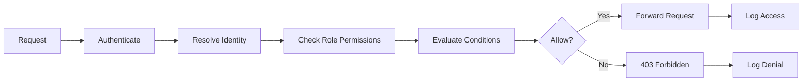
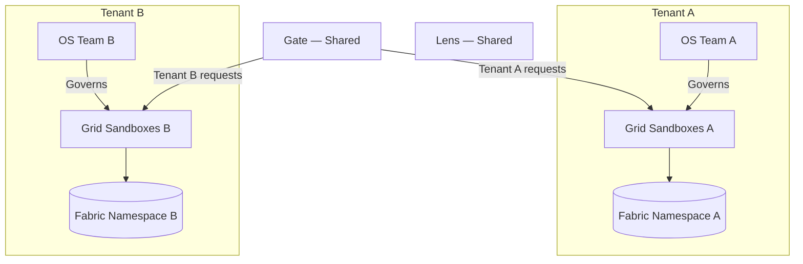
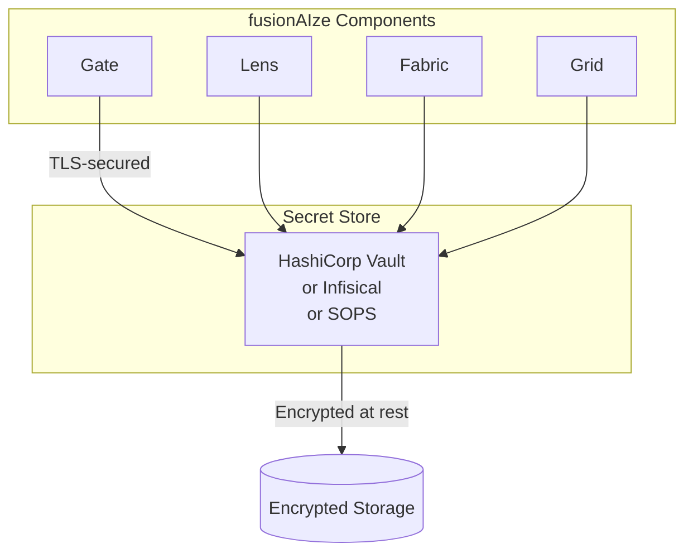
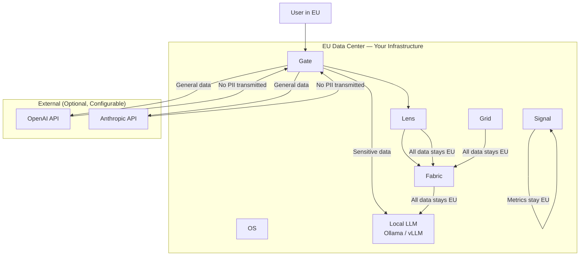

# Security Model

**How fusionAIze protects your data, identities, and infrastructure.**

---

## Overview

fusionAIze processes sensitive data — customer conversations, internal
knowledge bases, API credentials, and team identities. The security model
is designed from first principles for a **sovereign AI-native platform**:
data stays on your infrastructure, authentication is rigorous, isolation is
enforced at the sandbox level, and every action is auditable.

The model rests on five pillars:

1. **Authentication and Authorization** — who can do what.
2. **Data Isolation** — separating tenants, roles, and execution contexts.
3. **Secret Management** — how credentials are stored and accessed.
4. **Audit Logging** — immutable records of every significant action.
5. **Data Residency** — where data lives and how it complies with
   regulations.

---

## Authentication and Authorization

### Identity Model

fusionAIze uses a **hierarchical identity model** managed by OS:

```
Organization
├── Team
│   ├── Human User (admin, operator, developer)
│   └── Virtual Employee (role-based identity)
└── API Client (service account)
```

Every identity in the system — human or virtual — has a unique,
cryptographically verifiable identifier. OS is the single source of
truth for all identity information.

### Authentication Methods

| Method | Use Case | Strength |
|--------|----------|----------|
| **API Key** | Service-to-service, SDK clients | Good — key rotation required |
| **OAuth 2.0 / OIDC** | Human users, web applications | Strong — supports SSO, MFA |
| **mTLS** | High-security, intra-cluster | Very strong — certificate-based |
| **Local** | Development, single-user setups | Adequate — not for production |

=== "API Key Authentication"
    ```bash
    # Generate an API key via OS
    fai os keys create --name "gate-to-fabric" --scopes "fabric:read,fabric:write"

    # Use the key in SDK clients
    export FUSIONAIZE_API_KEY="fai_sk_a1b2c3d4..."

    # Rotate keys regularly
    fai os keys rotate --key-id "key_789"
    ```

=== "OAuth 2.0 / OIDC"
    ```yaml
    # OS configuration
    auth:
      providers:
        - type: oidc
          issuer: https://auth.example.com
          client_id: fusionaize-platform
          client_secret: "${OIDC_CLIENT_SECRET}"  # from environment
          scopes: [openid, profile, email]
          claims:
            email: email
            name: name
            groups: groups  # maps to OS team memberships

        - type: oauth2
          provider: github
          client_id: "${GITHUB_CLIENT_ID}"
          client_secret: "${GITHUB_CLIENT_SECRET}"
          scopes: [read:org, user:email]
          team_mapping:
            source: org_membership
            orgs:
              my-org: developers
    ```

=== "mTLS"
    ```yaml
    # Gate configuration for mTLS
    tls:
      server:
        cert_file: /etc/fusionaize/certs/gate.crt
        key_file: /etc/fusionaize/certs/gate.key
      client_auth:
        mode: require_and_verify
        ca_file: /etc/fusionaize/certs/ca.crt
        allowed_sans:
          - "*.fusionaize.internal"
          - "grid.fusionaize.svc"
    ```

### Authorization Model

OS implements **role-based access control (RBAC)** with attribute-based
conditions:

```yaml
# OS role definition
role: customer-support-agent
permissions:
  - resource: chat
    actions: [invoke]
    conditions:
      max_tokens_per_request: 1000
      allowed_models: [primary, backup]

  - resource: memory
    actions: [read]
    conditions:
      namespaces: [product_docs, refund_policies]
      exclude_namespaces: [customer_pii, internal_secrets]

  - resource: tool:email
    actions: [draft]
    conditions:
      require_approval: true
      allowed_recipients: [support@example.com]

  - resource: tool:billing_api
    actions: []  # explicitly denied
```

### Policy Enforcement



Policy checks happen at two points in the pipeline:

1. **Gate** — evaluates permissions on every incoming request before
   routing to a provider or downstream component.
2. **Grid** — evaluates tool access permissions during execution, blocking
   unauthorized tool invocations in real time.

---

## Data Isolation

### Tenant Isolation

For multi-tenant deployments (agencies, enterprise), data is isolated at
multiple levels:



| Isolation Level | Mechanism |
|-----------------|-----------|
| **Fabric namespaces** | Each tenant gets a dedicated namespace; cross-namespace queries are blocked at the API level |
| **Grid sandboxes** | Each tenant's sandboxes run on dedicated Docker networks or Kubernetes namespaces |
| **OS teams** | Roles, policies, and identities are scoped to teams; cross-team access requires explicit grant |
| **Signal dashboards** | Metrics and logs are filtered by tenant; operators only see their own telemetry |

### Execution Isolation

Grid enforces **sandbox isolation** at the runtime level:

```yaml
# Grid sandbox configuration
sandbox:
  isolation:
    # Network isolation
    network:
      mode: restricted
      egress:
        allowed_domains:
          - api.openai.com
          - api.anthropic.com
        denied_domains:
          - "*"  # block all other egress
      ingress: deny_all

    # Filesystem isolation
    filesystem:
      writable: false  # except /tmp
      mounts: []

    # Process isolation
    processes:
      max: 1
      capabilities: []  # drop all capabilities

    # Resource limits
    resources:
      cpu_max: "2"
      memory_max: "512Mi"
      timeout_seconds: 300

    # Tool access (controlled by OS policy)
    tools: []  # none unless explicitly granted by role
```

### Memory and Context Isolation

Fabric enforces **namespace-level access control** on all memory
operations:

```
Namespace: customer_pii
  Role: customer-support-agent → read
  Role: data-analyst → none
  Role: admin → read, write, delete

Namespace: internal_secrets
  Role: customer-support-agent → none
  Role: data-analyst → read
  Role: admin → read, write, delete
```

A virtual employee can only retrieve memories from namespaces their
role has been granted access to. Attempts to query denied namespaces are
logged and alertable via Signal.

---

## Secret Management

### Principles

1. **Secrets never touch source code.** No API keys, tokens, or
   credentials in config files, environment variables committed to repos,
   or hardcoded in application code.
2. **Secrets are stored encrypted at rest.** The secret store encrypts
   all values before persisting them.
3. **Secrets are accessed at runtime, not at build time.** Containers
   pull secrets from the store when they start.
4. **Secrets are rotated automatically.** OS supports automatic key
   rotation with configurable intervals.

### Secret Store Architecture



### Secret Types Managed

| Secret | Purpose | Rotation |
|--------|---------|----------|
| API keys (OpenAI, Anthropic, etc.) | Provider authentication | 30 days |
| Database credentials | Fabric, OS storage access | 90 days |
| TLS certificates | mTLS between components | 90 days |
| OAuth client secrets | User authentication | 90 days |
| Encryption keys | Data at rest encryption | 180 days |
| Webhook signing secrets | Outgoing webhook verification | 90 days |

### SDK Secret Access

The SDK never directly handles secret material. It authenticates via:

1. **API key** — a single revocable token for service-to-service access.
2. **OAuth token** — a short-lived token with refresh capability.
3. **mTLS certificate** — a client certificate provisioned at deploy time.

```typescript
// The SDK never sees provider API keys — Gate handles that
const gate = new GateClient({
  baseUrl: "https://gate.fusionaize.example.com",
  apiKey: process.env.FUSIONAIZE_API_KEY,  // Gate API key only
  // No OpenAI keys, no Anthropic keys — Gate manages those
});
```

---

## Audit Logging

### What Gets Logged

Every significant action across the stack generates an immutable audit
entry:

| Event Category | Examples |
|----------------|----------|
| **Authentication** | Login, logout, token refresh, failed auth attempts |
| **Authorization** | Permission checks, denied access, policy modifications |
| **Data access** | Memory reads/writes, namespace access |
| **Execution** | Sandbox start/stop, tool invocations, constraint violations |
| **Configuration** | Role changes, policy updates, provider configuration |
| **Administrative** | User management, key rotation, deployment events |

### Audit Entry Format

```json
{
  "audit_id": "aud_9f3a2b1c",
  "timestamp": "2025-07-19T14:31:22.451Z",
  "actor": {
    "type": "virtual_employee",
    "id": "role:customer-support-agent-01",
    "team": "support-team"
  },
  "action": "memory.read",
  "resource": {
    "type": "fabric_namespace",
    "id": "product_docs",
    "name": "Product Documentation"
  },
  "outcome": "allowed",
  "context": {
    "request_id": "req_abc123",
    "gate_route": "primary",
    "conversation_id": "conv_xyz789"
  },
  "metadata": {
    "query": "refund policy",
    "results_returned": 3,
    "latency_ms": 12
  }
}
```

### Audit Storage and Retention

- **Storage** — audit logs are written to an append-only log (e.g., a
  dedicated PostgreSQL table with no UPDATE/DELETE permissions for
  application roles).
- **Retention** — configurable by organization policy. Default: 365 days.
- **Tamper protection** — audit entries are checksummed and the checksums
  are chained (Merkle tree). Any tampering with historical entries is
  detectable.
- **Export** — audit logs can be streamed to external SIEM systems
  (Splunk, Elastic, Datadog) via Signal adapters.

### Querying Audit Logs

```bash
# Query audit logs via SDK
fai os audit --actor role:customer-support-agent-01 --action memory.read --since 24h

# Stream to SIEM (Signal adapter)
signal_siem:
  type: splunk_hec
  endpoint: https://splunk.example.com:8088/services/collector
  token: "${SPLUNK_HEC_TOKEN}"
  events: [audit, alert, security]
```

---

## EU Hosting and Data Residency

### Sovereignty by Design

fusionAIze is built for **data sovereignty**. Unlike SaaS AI platforms
where your data transits through third-party infrastructure, fusionAIze
runs entirely on infrastructure you control.

### Deployment Options by Region

| Region | Infrastructure | Compliance |
|--------|---------------|------------|
| **EU (Frankfurt, Paris, Amsterdam)** | Hetzner, OVH, Scaleway, AWS eu-central-1 | DSGVO, EU AI Act |
| **EU (Own DC)** | On-premise, colocation | Full sovereignty |
| **US** | AWS us-east-1, GCP us-central1 | SOC 2 |
| **Switzerland** | Swisscom, Exoscale | Swiss FADP |

### DSGVO / GDPR Alignment

| Requirement | How fusionAIze Meets It |
|-------------|------------------------|
| **Data minimization** | Lens compresses context; Fabric only stores what's explicitly written; Signal retains telemetry for configurable windows |
| **Purpose limitation** | Role-based access control ensures data is only used for authorized purposes |
| **Right to access** | Fabric search API can retrieve all memories associated with a user identity |
| **Right to erasure** | Fabric and OS support deletion of all data associated with an identity via a single API call |
| **Data portability** | All data can be exported in structured formats (JSON, Parquet) |
| **Processing records** | Audit logs provide a complete processing record |
| **DPA** | Available for enterprise customers |
| **Sub-processors** | None — all processing happens on your infrastructure |

### Local Model Routing for Sensitive Data

For use cases involving PII or other sensitive data that must not leave
your infrastructure:

```yaml
# providers.yml — sensitive data routing
routes:
  sensitive:
    description: "Routes handling PII and regulated data"
    providers:
      - name: local-llama
        type: ollama
        endpoint: http://gpu-node-1.internal:11434
        weight: 100
    constraints:
      provider_location: eu
      model_location: on_premise
      data_egress: none

  general:
    description: "Routes for non-sensitive general queries"
    providers:
      - name: anthropic-claude
        type: anthropic
        weight: 60
      - name: openai-gpt4
        type: openai
        weight: 40
```

Gate's routing engine enforces that sensitive requests never leave the
local infrastructure by matching request classifications to route
constraints.

### Data Flow Diagram for EU-Hosted Deployment



!!! tip "No PII by Default"
    By default, Gate strips known PII patterns (emails, phone numbers,
    credit card numbers, SSNs) from prompts before they leave your
    infrastructure, even when routing to external providers. This
    behavior is configurable and can be disabled for local-only
    deployments.

---

## Security Hardening Checklist

### Deployment Time

- [ ] Enable mTLS between all components (not just external-facing endpoints).
- [ ] Configure a secret store (Vault, Infisical, or SOPS) — never use
  environment variables for provider API keys.
- [ ] Set up automatic certificate rotation (cert-manager or equivalent).
- [ ] Enable audit logging with tamper-protection enabled.
- [ ] Configure network policies to restrict cross-component communication
  to required paths only.
- [ ] Set resource limits on all containers (CPU, memory, disk).
- [ ] Run containers as non-root users.
- [ ] Mount filesystems as read-only except for data directories.
- [ ] Configure firewall rules to allow only necessary inbound ports.

### Operational

- [ ] Rotate API keys on schedule (automated via OS).
- [ ] Review audit logs weekly for anomalies.
- [ ] Keep all fusionAIze component images updated to the latest patch.
- [ ] Monitor Signal for security-relevant alerts (failed auth spikes,
  denied access patterns, constraint violations).
- [ ] Conduct periodic access reviews — remove unused roles and permissions.
- [ ] Test backup and restore procedures quarterly.

### Development

- [ ] Run dependency vulnerability scans (Dependabot, Snyk, Trivy) in CI.
- [ ] Scan container images for known CVEs before deployment.
- [ ] Use signed commits and signed container images.
- [ ] Run secret detection in CI (detect-secrets, truffleHog) to prevent
  credential leaks in source code.
- [ ] Keep SDK dependencies updated to avoid transitive vulnerabilities.

---

## Reporting Security Issues

See our [Security Policy](https://git.langevc.com/fusionaize/fusionaize-docs/src/branch/main/SECURITY.md)
for how to report vulnerabilities securely. We respond within 48 hours and
aim to resolve critical issues within 7 days.
