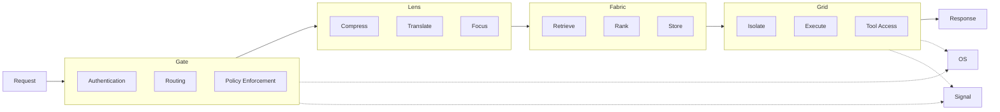
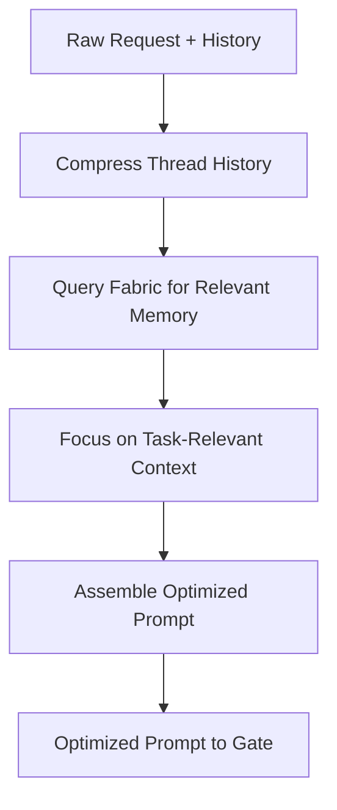
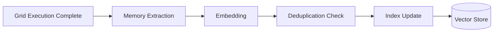
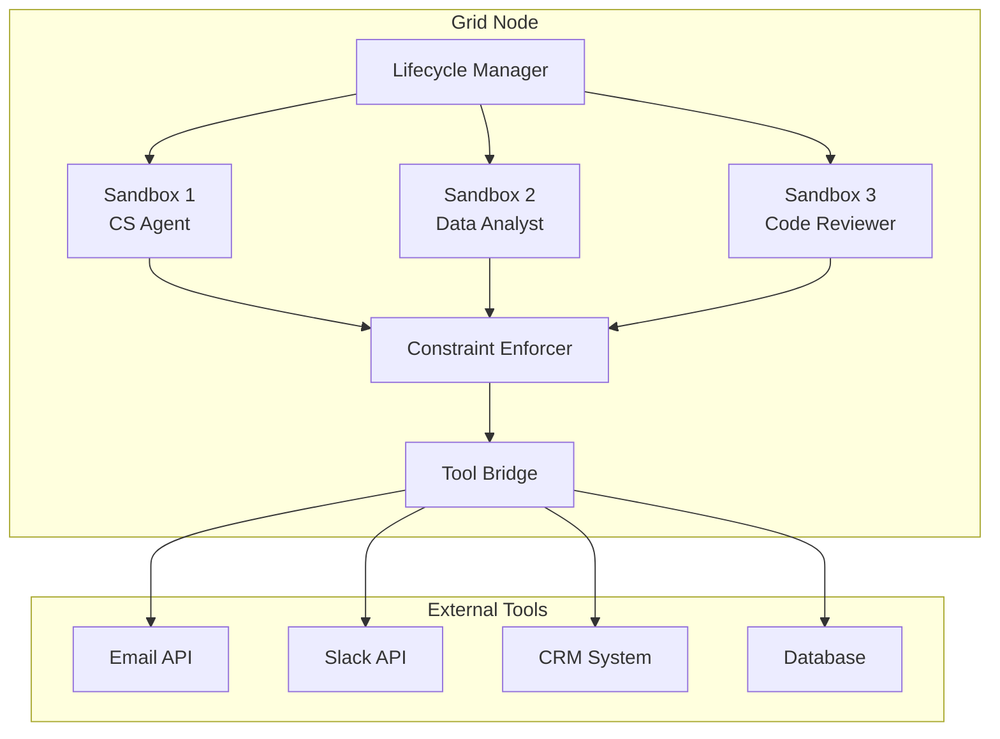
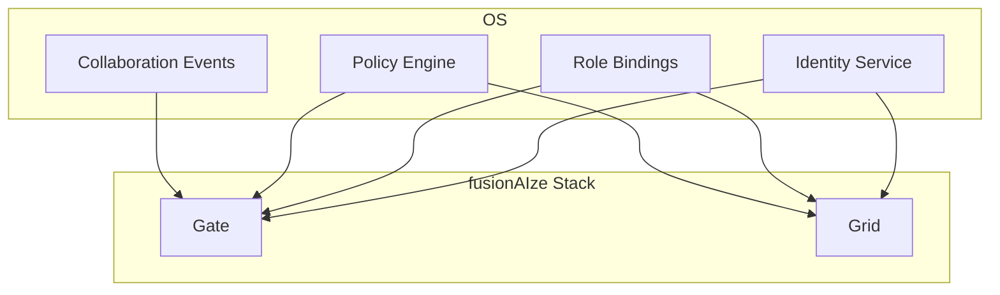
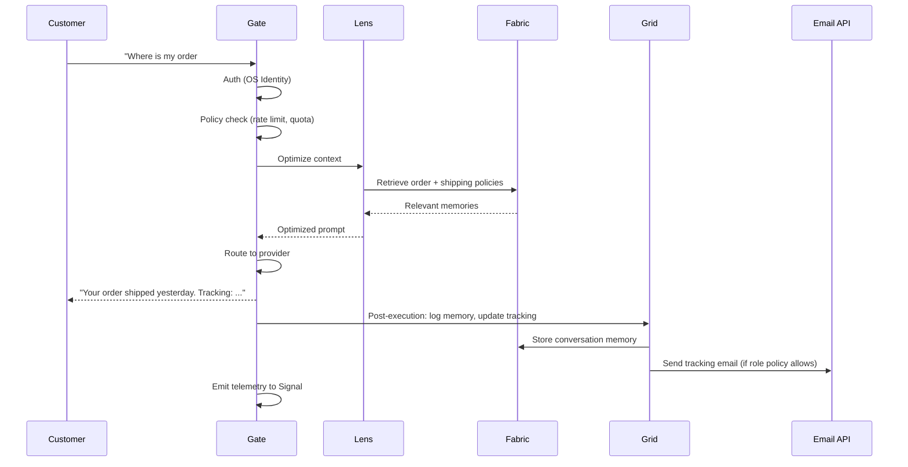

# Stack Integration

**How the fusionAIze components form a coherent pipeline — from request to execution to insight.**

---

## The Core Pipeline

The fusionAIze stack processes every interaction through a four-stage
pipeline: **Gate → Lens → Fabric → Grid**. Each stage adds a specific
capability, and the output of one feeds the input of the next.



While the pipeline is sequential, OS and Signal operate **orthogonally**
— OS provides the identity and policy fabric, and Signal observes
everything.

---

## Stage 1: Gate — The Entry Point

Gate is the **single entry point** for all external interactions with the
fusionAIze stack. Every request — whether from a human user, an API client,
or another service — passes through Gate.

### Gate's Responsibilities in the Pipeline

1. **Authenticate** the caller against OS identity providers.
2. **Authorize** the request against role-based policies.
3. **Route** the request to the appropriate AI provider (cloud or local).
4. **Enforce** rate limits, quotas, and cost caps.
5. **Transform** the response into a standard format.

```yaml
# Example Gate routing configuration
routes:
  primary:
    providers:
      - name: anthropic-claude
        weight: 70
        models: [claude-3-opus, claude-3-sonnet]
      - name: openai-gpt4
        weight: 30
        models: [gpt-4o]
    failover:
      - name: local-llama
        models: [llama-3-70b]
    constraints:
      max_latency_ms: 5000
      max_cost_per_1k_tokens: 0.03
```

### What Gate Passes Forward

After processing, Gate forwards a **normalized request** downstream:

```json
{
  "caller": {
    "identity": "role:customer-support-agent-01",
    "scopes": ["chat:invoke", "memory:read", "tool:email:draft"]
  },
  "request": {
    "prompt": "Customer asks about refund policy for order #1234...",
    "max_tokens": 500,
    "temperature": 0.7
  },
  "context": {
    "conversation_id": "conv_abc123",
    "thread_history": []
  }
}
```

---

## Stage 2: Lens — Context Optimization

Lens receives the normalized request from Gate and optimizes the context
window. Its goal is to **maximize useful information per token**.

### Lens Processing Steps



1. **Compress** — reduce thread history by summarizing or truncating
   older messages while preserving key facts and decisions.
2. **Retrieve** — query Fabric for stored memories, knowledge, and facts
   relevant to the current task.
3. **Focus** — prioritize context based on relevance, recency, and task
   requirements. Deprioritize or drop irrelevant context.
4. **Assemble** — build the final prompt struct with system instructions,
   retrieved memory, compressed history, and the current query — all
   within the token budget.

### What Lens Produces

```json
{
  "token_budget": {
    "total": 8000,
    "system_instructions": 500,
    "retrieved_memory": 1200,
    "compressed_history": 800,
    "current_query": 150,
    "reserved_for_response": 1000,
    "remaining": 4350
  },
  "retrieved_chunks": [
    {
      "content": "Refund policy: 30-day return window...",
      "source": "knowledge_base/refund_policy",
      "score": 0.94
    }
  ]
}
```

---

## Stage 3: Fabric — Memory Retrieval and Storage

Fabric is Lens's **memory backend**. It stores, indexes, and retrieves
structured memories, knowledge, and facts.

### Fabric's Role in the Pipeline

During context assembly, Lens calls Fabric with:

```json
{
  "query": "refund policy order shipping damage",
  "top_k": 5,
  "filters": {
    "source_type": ["knowledge_base", "policy_doc"],
    "recency": "90d"
  }
}
```

Fabric returns ranked results with relevance scores:

```json
{
  "results": [
    {
      "id": "mem_789",
      "content": "Returns accepted within 30 days. Shipping damage...",
      "metadata": {
        "source": "refund_policy_v3",
        "last_updated": "2024-11-15"
      },
      "score": 0.94
    }
  ],
  "query_time_ms": 12
}
```

### Post-Execution Memory Storage

After Grid finishes execution, new memories flow back to Fabric:



---

## Stage 4: Grid — Execution Foundation

Grid is the **execution substrate** where virtual employees run. It
provides isolated sandboxes, tool access, and lifecycle management.

### Grid's Responsibilities

1. **Isolation** — each execution runs in its own sandbox (container,
   microVM, or namespace).
2. **Tool access** — a controlled bridge between the sandbox and
   external tools (email, Slack, APIs, databases).
3. **Lifecycle** — start, pause, resume, and terminate execution sessions.
4. **Constraints** — enforce the role's constraint policies during
   execution.



### Execution Lifecycle

```
Request arrives → Grid allocates sandbox → loads role blueprint
→ binds tool permissions → executes → emits telemetry → stores memory → responds
```

??? example "Grid Execution Example"
    ```json
    {
      "execution_id": "exec_456",
      "role": "customer-support-agent-01",
      "sandbox": {
        "type": "container",
        "image": "fusionaize/grid-runner:latest",
        "isolation": "process+network"
      },
      "tool_grants": [
        {
          "tool": "email:send_draft",
          "constraint": "require_approval",
          "scope": ["support@example.com"]
        },
        {
          "tool": "knowledge_base:search",
          "constraint": "read_only",
          "scope": ["product_docs", "refund_policies"]
        }
      ],
      "status": "running"
    }
    ```

---

## OS — Team Orchestration Layer

OS operates transversely across the pipeline, providing **identity,
policy, and collaboration** services:



### OS Integration Points

| Integration | What OS Provides | Used By |
|-------------|-----------------|---------|
| Authentication | Token validation, identity resolution | Gate |
| Authorization | Role-based access control, scope validation | Gate, Grid |
| Role definitions | Virtual employee identity and constraints | Grid |
| Policy enforcement | Rate limits, quotas, access policies | Gate, Grid |
| Collaboration | Handoff events, escalation paths, approvals | Grid |

---

## Integration Patterns

### Pattern 1: Direct HTTP (REST)

Used between components in the same network (low latency, strong typing):

```
Client → Gate → Lens → Fabric
                  Gate → Grid
```

OpenAPI specs in the SDK's `contracts/` directory define these interfaces.

### Pattern 2: gRPC Streaming

Used for high-throughput, streaming communication:

```
Grid ← → Fabric (memory streaming)
Gate ← → Lens (context streaming)
Signal ← → All (metrics streaming)
```

Protobuf definitions in `contracts/proto/` define these interfaces.

### Pattern 3: Message Queue (Async)

Used for fire-and-forget, event-driven communication:

```
Grid → [MQ] → Fabric (memory ingestion)
All → [MQ] → Signal (telemetry collection)
```

The message queue is the **event backbone** of the stack. Every component
emits structured events to a shared topic. Signal consumes all topics.
Fabric consumes memory-related topics. Other components subscribe as
needed.

### Pattern 4: Sidecar Proxy

For deployments where co-location matters:

```yaml
# docker-compose fragment
services:
  grid-runner:
    image: fusionaize/grid-runner:latest
    depends_on:
      - signal-collector  # sidecar

  signal-collector:
    image: fusionaize/signal-collector:latest
    network_mode: "service:grid-runner"
    volumes:
      - ./config/signal-collector.yml:/etc/signal/config.yml
```

The Signal collector runs as a sidecar on the same network namespace,
capturing local metrics without exposing endpoints externally.

---

## Complete Integration Example

A virtual employee answering a customer query end-to-end:



---

## Key Design Constraints

1. **Every request goes through Gate.** No component is externally
   accessible except through Gate. This ensures consistent authentication,
   authorization, and auditing.

2. **Memory flows through Fabric.** No component stores persistent state
   independently. Fabric is the single source of truth for knowledge and
   memory.

3. **Execution happens on Grid.** Virtual employees never run in-process
   inside Gate or any other component. Grid provides the isolation
   boundary.

4. **Telemetry goes to Signal.** Every component emits structured
   telemetry to Signal's collectors. There are no side-channels for
   observability.

5. **OS governs identity and policy.** No component makes authorization
   decisions independently. OS is the authoritative source for who can
   do what.

6. **Contracts are the boundaries.** Components communicate only through
   typed, versioned contracts. There is no shared database, no direct
   filesystem access between components, and no implicit coupling.
