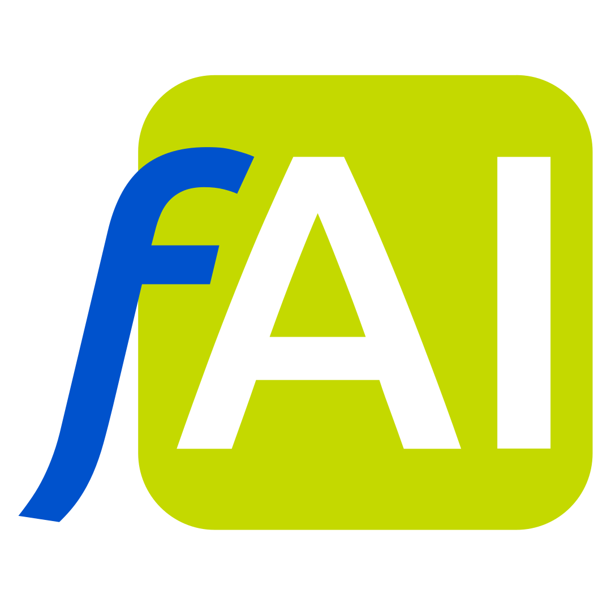

---
hide:
  - toc
---

# <span style="display:none">fusionAIze</span>

<div markdown align="center">

{ width="180" }

# Where human ingenuity and AI innovation merge.

**fusionAIze** is the operating brand for human-AI fusion teams — the first platform that combines brand, product stack, enablement, and operational execution into a unified system for building AI-powered virtual employees.

[Get Started](getting-started/index.md){ .md-button .md-button--primary }
[Explore the Stack](about/platform.md){ .md-button }

</div>

---

## The fusion team

Most AI platforms hand you models and APIs and call it a day. That leaves you to figure out the rest — the memory, the collaboration patterns, the guardrails, the culture.

fusionAIze starts from a different question: **what would it take for an AI-powered virtual employee to be as natural and trusted as any human colleague?**

The answer isn't just a model. It's a stack, an operating logic, an enablement framework, and a shared memory fabric — all designed so that humans and AIs work together as a **fusion team**, not as tool and user.

<div markdown align="center">

[:fontawesome-solid-brain: The Vision](about/vision.md){ .md-button }
[:fontawesome-solid-palette: Our Brand](about/brand.md){ .md-button }
[:fontawesome-solid-road: Roadmap](about/roadmap.md){ .md-button }

</div>

---

## The product stack

fusionAIze provides a layered architecture that grows with your team, from a solo freelancer to a globally distributed enterprise.

### Core stack

| Component | Role | Description |
|-----------|------|-------------|
| **Gate** `faigate` | AI Gateway | Unified interface to all models, providers, and tools. Routing, failover, and cost governance for every AI call in your organisation. |
| **Lens** `failens` | Context Layer | Compresses, focuses, and translates context so AI collaborators see what matters — not what's irrelevant. |
| **Fabric** `faifabric` | Memory Fabric | Shared, persistent knowledge across every interaction. Eliminates the "blank slate" problem that plagues isolated AI calls. |
| **Grid** `faigrid` | Execution Substrate | Sovereign execution environment where AI agents run with the boundaries your team defines. |
| **faios** `faios` | Operating Logic | The team logic layer: roles, policies, onboarding, handover protocols, and the collaboration patterns that make fusion teams work. |

### Extended stack

| Component | Role | Description |
|-----------|------|-------------|
| **Studio** `faistudio` | Blueprint Authoring | Design, test, and refine virtual employee behaviour before deployment. |
| **Signal** `faisignal` | Operational Intelligence | Real-time monitoring, cost tracking, quality metrics, and collaboration analytics. |
| **SDK** `faisdk` | Integration Layer | Language-native libraries to embed fusionAIze into your existing stack. |

!!! tip "Want the full picture?"
    The [Platform Overview](about/platform.md) shows how these components connect and flow together, with a visual diagram of the entire architecture.

---

## Built for every team

<div class="grid cards" markdown>

-   :fontawesome-solid-user-gear:{ .lg .middle } **Freelancers & Solopreneurs**

    ---

    Ship faster with AI collaborators that remember your preferences, follow your patterns, and handle the busywork while you focus on craft.

    [:octicons-arrow-right-24: Read more](audiences/freelancer.md)

-   :fontawesome-solid-building:{ .lg .middle } **Agencies**

    ---

    Scale delivery without scaling headcount. Standardise client workflows, build reusable fusion team patterns, and move from billable hours to outcome-based value.

    [:octicons-arrow-right-24: Read more](audiences/agency.md)

-   :fontawesome-solid-shop:{ .lg .middle } **SMEs**

    ---

    Get enterprise-grade AI infrastructure without the enterprise complexity. Deploy on-premise or in your own cloud, with full data sovereignty.

    [:octicons-arrow-right-24: Read more](audiences/sme.md)

-   :fontawesome-solid-building-columns:{ .lg .middle } **Enterprise**

    ---

    Deploy fusion teams at scale with fine-grained governance, audit trails, RBAC, and integration with your existing identity and compliance infrastructure.

    [:octicons-arrow-right-24: Read more](audiences/enterprise.md)

</div>

---

## Open-core, commercially sustainable

fusionAIze follows an **open-core model** that keeps the foundational stack free and open while sustaining the project through premium enterprise features.

All core components are released under **Apache 2.0** — the most permissive, enterprise-friendly open-source license. Premium features (advanced governance, enterprise deployment profiles, Academy platform) are source-available or proprietary.

!!! info "Open-core"
    Read the full breakdown: [Open-Core Model](about/open-core.md)

---

## Quickstart

Spin up your first fusionAIze stack in under five minutes.

```bash
# Clone the core repository
git clone https://git.langevc.com/fusionaize/faigate.git
cd faigate

# Start the stack with Docker Compose
docker compose up -d

# The Gate is now running on http://localhost:8120
# Configure your first provider and model in the dashboard
```

[:fontawesome-solid-rocket: Full Quickstart Guide](getting-started/index.md){ .md-button }

---

## Stay connected

<div markdown align="center">

:fontawesome-brands-github: [GitHub (Mirror)](https://github.com/fusionAIze) &nbsp;·&nbsp;
:fontawesome-solid-code: [Forgejo (Primary)](https://git.langevc.com/fusionaize) &nbsp;·&nbsp;
:fontawesome-solid-book: [Contributing](contributing/index.md) &nbsp;·&nbsp;
:fontawesome-solid-shield-halved: [Security](compliance/security.md)

</div>
