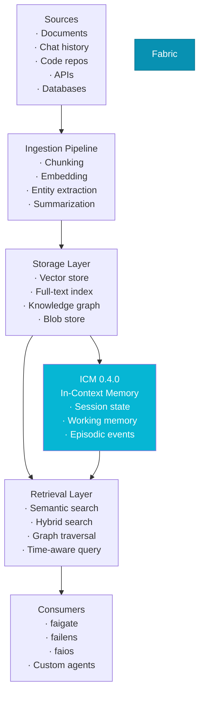
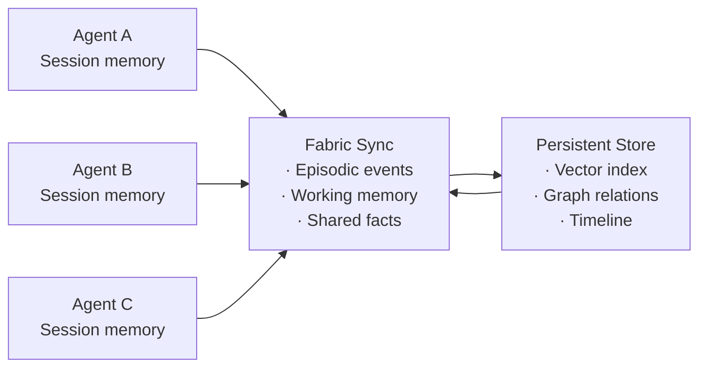
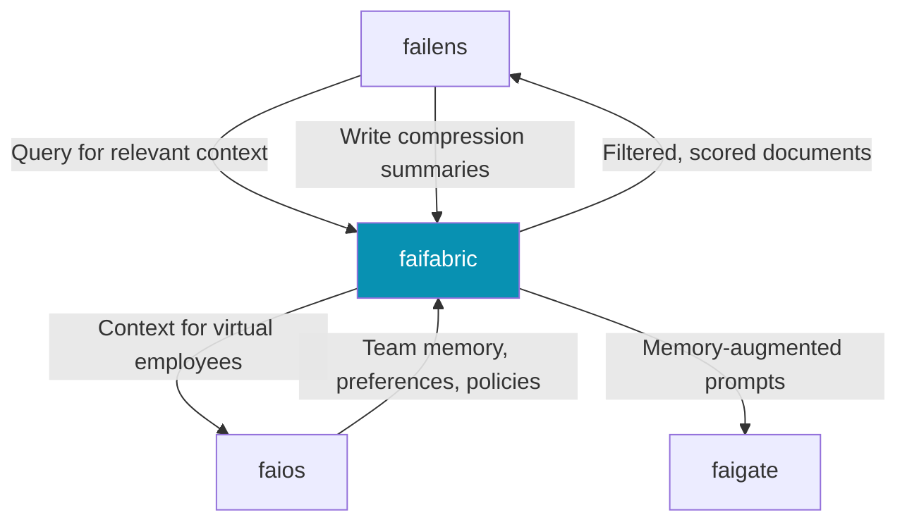

# faifabric — Shared Memory Fabric

**faifabric** is the shared context, memory, and knowledge fabric of the fusionAIze stack. It provides ingestion, semantic retrieval, memory synchronization, and knowledge graph construction — the long-term memory that makes AI interactions coherent across sessions, users, and teams.

---

## What is Fabric?

Every AI conversation starts from zero. Without shared memory, each interaction is isolated — context must be rebuilt every time. **Fabric** gives AI systems persistent, searchable, evolving memory. It ingests documents, conversations, and structured data; stores them in vector indexes, full-text stores, and knowledge graphs; and retrieves the right context at the right time.



---

## Key Capabilities

### Context Ingestion

Fabric ingests content from multiple sources through pluggable pipelines:

```yaml title="fabric.yaml — ingestion"
ingestion:
  pipelines:
    - name: "docs"
      source:
        type: "filesystem"
        path: "/data/docs"
        watch: true          # Watch for changes
      chunking:
        strategy: "recursive"
        chunk_size: 512
        chunk_overlap: 64
      embedding:
        model: "text-embedding-3-small"
        dimensions: 1536

    - name: "chat-archive"
      source:
        type: "api"
        url: "https://gate.example.com/v1/usage"
        schedule: "0 */6 * * *"
      chunking:
        strategy: "message"
      embedding:
        model: "text-embedding-3-small"

    - name: "github"
      source:
        type: "git"
        url: "https://github.com/org/repo"
        branch: "main"
      chunking:
        strategy: "code"
        language: "auto"
```

**Supported sources:**

| Source type | Description |
|-------------|-------------|
| `filesystem` | Local directories with file watching |
| `api` | REST endpoints with scheduling |
| `git` | Git repositories, branches, and commits |
| `database` | PostgreSQL, MySQL, SQLite tables |
| `s3` | S3-compatible object storage |
| `webhook` | Push-based ingestion via HTTP webhooks |
| `stream` | Kafka, Redis streams, event buses |

### Semantic Retrieval

Fabric combines multiple retrieval strategies for maximum precision:

```yaml
retrieval:
  default_strategy: "hybrid"

  strategies:
    - name: "vector"
      type: "semantic"
      encoder: "text-embedding-3-small"
      index: "hnsw"
      params:
        ef_search: 128
        m: 16

    - name: "keyword"
      type: "fulltext"
      engine: "bm25"

    - name: "graph"
      type: "knowledge-graph"
      traversal_depth: 2

    - name: "hybrid"
      type: "fusion"
      components:
        - strategy: "vector"
          weight: 0.5
        - strategy: "keyword"
          weight: 0.3
        - strategy: "graph"
          weight: 0.2
      fusion_method: "reciprocal-rank"
```

```python title="retrieval_example.py"
from faifabric import FabricClient

client = FabricClient("http://localhost:8081")

results = client.search(
    query="How to configure rate limiting in faigate?",
    strategy="hybrid",
    max_results=5,
    min_score=0.6,
    filters={
        "source_type": "documentation",
        "product": "faigate"
    }
)

for doc in results:
    print(f"[{doc.score:.2f}] {doc.title}")
    print(f"    {doc.preview}")
```

### Memory Sync

Fabric synchronizes memory across sessions, agents, and team members:



**Sync modes:**

| Mode | Description |
|------|-------------|
| **Episodic** | Session-level events, decisions, and outcomes |
| **Working** | Active task context shared within a team |
| **Factual** | Verified facts and assertions — source-cited |
| **Preference** | User and team preferences, style guides |

### Knowledge Graphs

Fabric automatically constructs and maintains knowledge graphs from ingested content:

```yaml
knowledge_graph:
  enabled: true
  entity_extraction:
    model: "gpt-4o-mini"
    types:
      - person
      - organization
      - product
      - concept
      - technology
      - process

  relation_extraction:
    enabled: true
    types:
      - depends_on
      - implements
      - documents
      - configures
      - integrates_with
      - authored_by
```

Entities and relations are extracted during ingestion and kept current as content changes. The graph enables:

- **Graph-augmented retrieval** — expand search results through entity relationships
- **Impact analysis** — "what depends on this component?"
- **Cross-document linking** — auto-discover related content across sources

### ICM — In-Context Memory 0.4.0

ICM is Fabric's **working memory system**. It bridges session context and persistent storage, giving agents a short-term memory layer that survives across API calls within a session:

```python
from faifabric.icm import InContextMemory

icm = InContextMemory(session_id="agent-session-42")

# Store working facts
icm.remember("User prefers TypeScript over Python")
icm.remember("Current task: refactor auth module")
icm.remember("Deployment target: AWS ECS")

# Retrieve context for next call
context = icm.recall(limit=10)
# Returns most relevant working memory entries

# Persist important facts to long-term storage
icm.persist(["User prefers TypeScript over Python"])

# Clear on session end
icm.clear()
```

ICM supports:
- **TTL-based expiry** — working memory entries auto-expire
- **Priority levels** — critical facts persist longer
- **Contextual recall** — retrieve based on current query, not just recency
- **Episodic snapshots** — save full session state for later replay

---

## Integration with Lens and OS



| Integration | How it works |
|-------------|-------------|
| **failens** | Lens queries Fabric for context before every request. Fabric returns scored documents; Lens compresses and filters before sending to the model. Lens writes summaries of processed contexts back to Fabric as lightweight memory entries. |
| **faios** | OS uses Fabric as the shared memory substrate for virtual employees and teams. Preferences, policies, and team knowledge live in Fabric. OS configures per-role access scopes. |
| **faigate** | Gate can query Fabric directly for provider-specific context (API keys, fallback policies) stored as structured facts in the knowledge graph. |

---

## Quickstart

### 1. Install

```bash
npm install -g @fusionaize/faifabric

# Docker
docker pull fusionaize/faifabric:latest

# Run with Docker
docker run -d \
  -p 8081:8081 \
  -v ./fabric.yaml:/etc/fabric/fabric.yaml \
  -v ./data:/var/lib/fabric \
  fusionaize/faifabric:latest
```

### 2. Configure

```yaml title="fabric.yaml"
server:
  host: "0.0.0.0"
  port: 8081

storage:
  vector:
    backend: "qdrant"     # qdrant | chroma | pgvector
    url: "http://localhost:6333"
    collection: "fabric"

  fulltext:
    backend: "elasticsearch"
    url: "http://localhost:9200"

  graph:
    backend: "neo4j"
    url: "bolt://localhost:7687"

  blobs:
    backend: "filesystem"
    path: "/var/lib/fabric/blobs"

ingestion:
  pipelines:
    - name: "docs"
      source:
        type: "filesystem"
        path: "/data/docs"

embedding:
  provider: "openai"
  model: "text-embedding-3-small"
  dimensions: 1536

retrieval:
  default_strategy: "hybrid"
```

### 3. Ingest Content

```bash
# Ingest a directory
fabric ingest --pipeline docs --path ./documentation/

# Ingest from API
fabric ingest --pipeline chat-archive

# Check ingestion status
fabric status
```

```json
{
  "pipelines": {
    "docs": {
      "status": "idle",
      "documents_processed": 1247,
      "chunks": 8420,
      "last_run": "2026-07-19T10:30:00Z"
    }
  },
  "storage": {
    "vector_documents": 8420,
    "graph_entities": 391,
    "graph_relations": 1104,
    "total_size_bytes": 487200000
  }
}
```

### 4. Search

```bash
# Semantic search
fabric search "How to configure faigate routing?"

# With filters
fabric search "rate limiting" \
  --strategy hybrid \
  --max-results 5 \
  --filter source_type:documentation

# Graph traversal
fabric graph --query "What depends on faigate?"
```

### 5. Use the API

```python
from faifabric import FabricClient

fabric = FabricClient("http://localhost:8081")

# Ingest a document
fabric.ingest(
    content="# My Document\n\nContent here...",
    metadata={"source": "manual", "product": "faigate"}
)

# Search
results = fabric.search("document content query")
for doc in results:
    print(f"{doc.score:.3f} | {doc.metadata['title']}")

# ICM
from faifabric.icm import InContextMemory
icm = InContextMemory(session_id="demo")
icm.remember("Important fact about this session")
relevant = icm.recall("What was important?")
```

---

## Storage Backends

Fabric supports multiple backends for each storage type:

| Storage | Supported Backends |
|---------|--------------------|
| **Vector** | Qdrant, Chroma, pgvector, Weaviate, Milvus, LanceDB |
| **Full-text** | Elasticsearch, Meilisearch, Typesense, SQLite FTS |
| **Graph** | Neo4j, ArangoDB, Kuzu (embedded) |
| **Blob** | Filesystem, S3, MinIO |

For local and solo deployments, Fabric ships with **embedded backends** (LanceDB, SQLite FTS, Kuzu) — zero external dependencies required for getting started.

```yaml
# Minimal solo configuration — no external services
storage:
  vector:
    backend: "lancedb"
    path: "./data/vectors"
  fulltext:
    backend: "sqlite"
    path: "./data/fulltext.db"
  graph:
    backend: "kuzu"
    path: "./data/graph"
```
