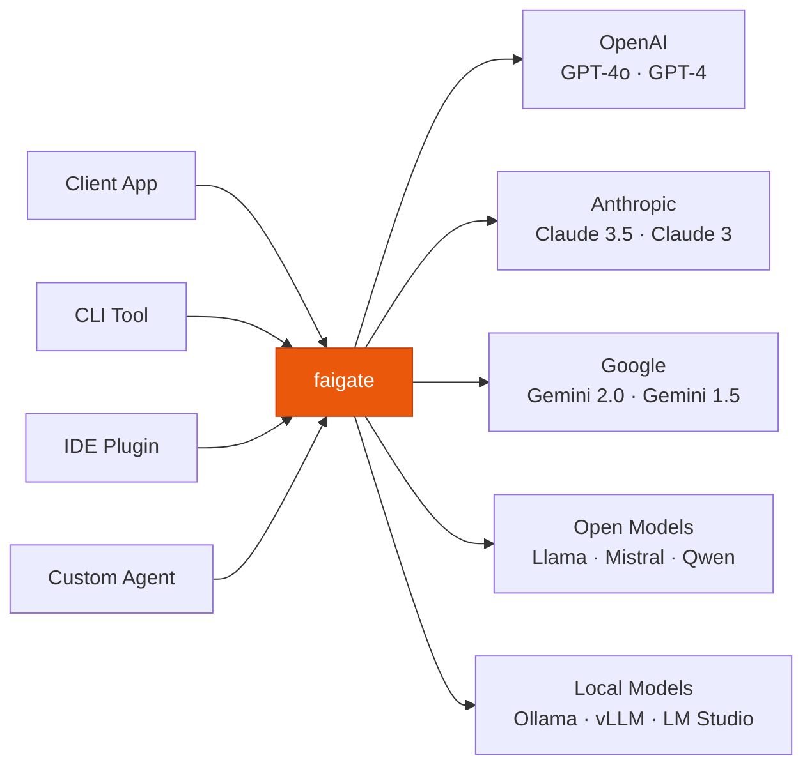
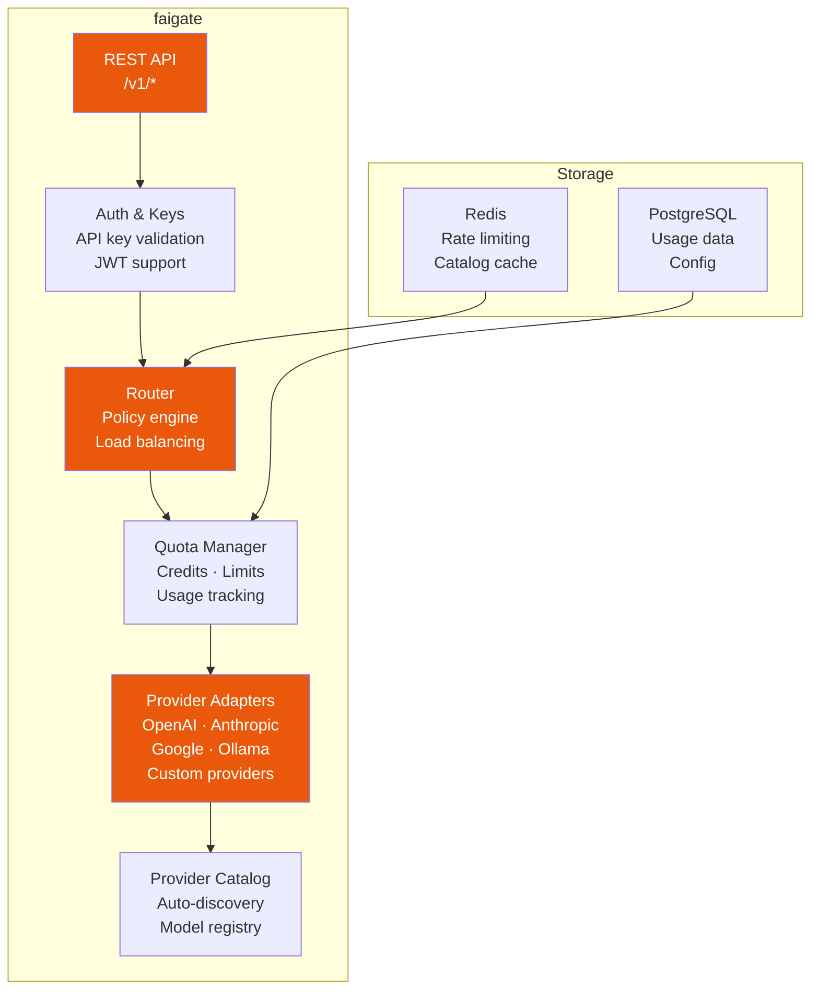

# faigate — AI-Native Gateway

**faigate** is the entry point of the fusionAIze stack. It connects AI models, providers, tools, and clients through a unified API — abstracting away provider differences, managing quotas, and routing requests intelligently.

---

## What is Gate?

Gate is an **API-native gateway** for AI model access. Instead of wiring each application directly to OpenAI, Anthropic, Google, or open-source models — each with their own SDK, authentication, and error handling — you point everything at Gate. Gate translates, routes, and tracks every request.



---

## Key Capabilities

### Multi-Provider Routing

Route requests across providers based on model capabilities, cost, latency, or availability. Gate supports:

- **Static routing** — pin requests to specific providers
- **Cost-optimized routing** — pick the cheapest available model for a capability class
- **Fallback routing** — fail over to another provider if the primary is unavailable
- **A/B routing** — split traffic between providers for evaluation

```yaml title="gate.yaml"
routing:
  policies:
    - name: "cost-optimized"
      strategy: "cheapest"
      model_class: "chat"
      providers: ["openai", "anthropic", "google"]

    - name: "ha-chat"
      strategy: "fallback"
      primary: "openai"
      fallback: "anthropic"
      model: "gpt-4o-2024-08-06"
```

### Model Unification

Gate presents a unified API surface regardless of provider. All chat completion requests use a single endpoint and format — Gate handles the translation internally.

```bash
# Same API — any model, any provider
curl -X POST https://gate.example.com/v1/chat/completions \
  -H "Authorization: Bearer fgsk_..." \
  -H "Content-Type: application/json" \
  -d '{
    "model": "gpt-4o",
    "messages": [{"role": "user", "content": "Explain quantum entanglement."}]
  }'
```

No SDK changes needed when switching providers. Gate accepts the OpenAI-compatible request format and translates it for the target provider.

### API Abstraction

Gate exposes a **provider-agnostic API** with these endpoints:

| Endpoint | Purpose |
|----------|---------|
| `/v1/chat/completions` | Chat completions (all providers) |
| `/v1/embeddings` | Text embeddings |
| `/v1/models` | List available models |
| `/v1/capabilities` | Query model capabilities |
| `/v1/usage` | Usage and credit tracker |
| `/v1/providers` | Provider catalog management |

!!! tip "OpenAI-Compatible"
    The `/v1/chat/completions` endpoint is **fully OpenAI-compatible**. Any tool or library that works with the OpenAI API works with Gate — just change the base URL.

### Credit & Usage Tracking

Gate tracks every request with per-key granularity:

- **Credits system** — allocate credits to API keys or teams
- **Usage logging** — every request logged with model, provider, tokens, latency
- **Quota enforcement** — hard or soft limits per key, team, or model class
- **Cost attribution** — tag requests for cost-center tracking

```bash
# Check usage for a key
curl https://gate.example.com/v1/usage \
  -H "Authorization: Bearer fgsk_..."
```

```json
{
  "key": "fgsk_a1b2c3...",
  "period": "2026-07",
  "total_credits": 5000,
  "used_credits": 1247,
  "requests": 8432,
  "tokens": {
    "input": 1420000,
    "output": 387000
  },
  "by_model": {
    "gpt-4o": { "requests": 5200, "credits": 890 },
    "claude-3.5-sonnet": { "requests": 3232, "credits": 357 }
  }
}
```

### Provider Catalog

Gate maintains a **dynamic provider catalog** that describes every available model, provider, and capability. The catalog updates automatically when providers add or deprecate models.

```yaml title="catalog entry example"
providers:
  openai:
    base_url: "https://api.openai.com/v1"
    models:
      - id: "gpt-4o-2024-08-06"
        class: "chat"
        capabilities:
          - text-generation
          - vision
          - function-calling
          - structured-outputs
        context_window: 128000
        max_output_tokens: 16384
        pricing:
          input_per_1k: 0.00250
          output_per_1k: 0.01000
```

---

## Architecture



### Adapter System

Each provider is supported through a dedicated adapter plugin:

```
adapters/
├── openai/
├── anthropic/
├── google/
├── ollama/
├── vllm/
├── mistral/
├── groq/
├── together/
└── custom/      # Build your own
```

Custom adapters are first-class — build one for any API that speaks HTTP.

---

## Quickstart

### 1. Install

```bash
# Via package manager
npm install -g @fusionaize/faigate

# Via Docker
docker pull fusionaize/faigate:latest

# Run with Docker
docker run -d \
  -p 8080:8080 \
  -v ./gate.yaml:/etc/gate/gate.yaml \
  fusionaize/faigate:latest
```

### 2. Configure Providers

Create a `gate.yaml` configuration:

```yaml title="gate.yaml"
server:
  host: "0.0.0.0"
  port: 8080

providers:
  openai:
    enabled: true
    api_key: "${OPENAI_API_KEY}"
    models:
      - gpt-4o
      - gpt-4o-mini

  anthropic:
    enabled: true
    api_key: "${ANTHROPIC_API_KEY}"
    models:
      - claude-3.5-sonnet

  ollama:
    enabled: true
    base_url: "http://localhost:11434"
    models:
      - llama3.3
      - qwen2.5

api_keys:
  - key: "fgsk_dev_a1b2c3..."
    name: "development"
    credits: 10000
    allowed_models: ["gpt-4o-mini", "llama3.3"]
```

!!! warning "Secrets"
    Never hardcode API keys. Use environment variables (`${VAR}`) or a secrets backend.

### 3. Route Your First Request

```bash
# Start Gate
faigate serve --config gate.yaml

# Send a chat request
curl http://localhost:8080/v1/chat/completions \
  -H "Authorization: Bearer fgsk_dev_a1b2c3..." \
  -H "Content-Type: application/json" \
  -d '{
    "model": "gpt-4o-mini",
    "messages": [{"role": "user", "content": "Hello, faigate!"}]
  }'

# List available models
curl http://localhost:8080/v1/models \
  -H "Authorization: Bearer fgsk_dev_a1b2c3..."
```

### 4. Integrate with Existing Tools

Gate works with any OpenAI-compatible client:

```python title="example.py"
from openai import OpenAI

client = OpenAI(
    base_url="http://localhost:8080/v1",
    api_key="fgsk_dev_a1b2c3..."
)

response = client.chat.completions.create(
    model="claude-3.5-sonnet",  # Routed through Gate
    messages=[{"role": "user", "content": "Hello!"}]
)
print(response.choices[0].message.content)
```

```typescript title="example.ts"
import OpenAI from "openai";

const client = new OpenAI({
  baseURL: "http://localhost:8080/v1",
  apiKey: "fgsk_dev_a1b2c3...",
});

const response = await client.chat.completions.create({
  model: "gpt-4o-mini",
  messages: [{ role: "user", content: "Hello!" }],
});
```

---

## Provider Catalog Integration

Gate ships with a built-in provider registry. Add third-party or self-hosted providers:

```yaml
providers:
  # Add a custom OpenAI-compatible endpoint
  my_custom_endpoint:
    enabled: true
    base_url: "https://my-inference.example.com/v1"
    api_key: "${MY_KEY}"
    openai_compatible: true
    models:
      - custom-model-v1
      - custom-model-v2
    pricing:
      custom-model-v1:
        input_per_1k: 0.00100
        output_per_1k: 0.00300
```

---

## Configuration Reference

```yaml title="Full gate.yaml reference"
# Server settings
server:
  host: "0.0.0.0"
  port: 8080
  tls:
    enabled: false
    cert_file: "/path/to/cert.pem"
    key_file: "/path/to/key.pem"

# Provider configuration
providers:
  <provider_name>:
    enabled: true|false
    base_url: "https://..."
    api_key: "sk-..." | "${ENV_VAR}"
    openai_compatible: true|false
    models:
      - model-id-1
      - model-id-2
    default_headers:
      X-Custom: "value"
    timeout_ms: 60000
    max_retries: 3

# Routing policies
routing:
  policies:
    - name: "policy-name"
      strategy: "cheapest" | "fallback" | "round-robin" | "fixed"
      model_class: "chat" | "embedding" | "any"
      model: "specific-model"  # optional filter
      providers: ["provider1"]
      primary: "provider1"    # for fallback
      fallback: "provider2"   # for fallback

# API key management
api_keys:
  - key: "fgsk_..."
    name: "label"
    credits: 10000
    allowed_models: []
    allowed_providers: []
    rate_limit_rpm: 1000

# Storage backends
storage:
  type: "postgres" | "sqlite"
  dsn: "postgres://..."
  redis_url: "redis://..."    # for caching & rate limiting

# Observability
observability:
  metrics:
    enabled: true
    port: 9090
  logging:
    level: "info" | "debug" | "warn"
    format: "json" | "text"
```

---

## Integration with the Stack

Gate integrates natively with other fusionAIze products:

| Product | Integration |
|---------|-------------|
| **failens** | Lens intercepts requests through Gate, applying context optimization before execution |
| **faifabric** | Gate queries Fabric for model-specific context to enrich prompts |
| **faigrid** | Gate delegates execution to Grid runners for local/on-premise model inference |
| **faios** | OS manages Gate API keys, team quotas, and provider access policies |

!!! note "Standalone Operation"
    Gate does **not** require any other fusionAIze product. It functions as a complete, independent AI gateway.
