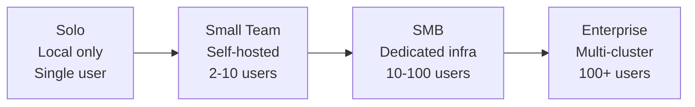

# Product Stack

The **fusionAIze platform** is a vertically integrated stack of six core products — each solving a distinct layer of the human-AI fusion stack. Together they provide everything from model access to team orchestration.

---

## Stack Overview

```mermaid
graph TB
    subgraph Clients["Clients & Integrations"]
        SDK["SDK / CLI"]
        Studio["Studio"]
        Signal["Signal"]
    end

    subgraph OS["faios — Fusion Team Operating Logic"]
        Identity["Identity & Roles"]
        Collab["Collaboration"]
        Guard["Guard Layer"]
        Dev["Development Layer"]
    end

    subgraph Fabric["faifabric — Shared Memory Fabric"]
        Ingest["Ingestion"]
        Retrieval["Semantic Retrieval"]
        Sync["Memory Sync"]
        ICM["ICM 0.4.0"]
        KG["Knowledge Graphs"]
    end

    subgraph Lens["failens — Context Focusing Layer"]
        Compress["Compression"]
        Relevance["Relevance Filtering"]
        Explain["Explanation"]
        Plugins["Plugin Architecture"]
    end

    subgraph Gate["faigate — AI-Native Gateway"]
        Routing["Multi-Provider Routing"]
        Unify["Model Unification"]
        Quota["Quota & Credits"]
        Catalog["Provider Catalog"]
    end

    subgraph Grid["faigrid — Execution Substrate"]
        Runner["Runner Queues"]
        Secrets["Secrets Vault"]
        Observe["Observability"]
        Recovery["Recovery Patterns"]
    end

    subgraph Providers["AI Providers"]
        OpenAI["OpenAI"]
        Anthropic["Anthropic"]
        Google["Google"]
        Open["Open Models"]
        Local["Local Models"]
    end

    Clients --> OS
    OS --> Fabric
    Fabric --> Lens
    Lens --> Gate
    Gate --> Grid
    Grid --> Providers

    style OS fill:#7c3aed,color:#fff
    style Fabric fill:#0891b2,color:#fff
    style Lens fill:#059669,color:#fff
    style Gate fill:#ea580c,color:#fff
    style Grid fill:#2563eb,color:#fff
```

### Data Flow

Requests enter the stack at **Gate**, pass through **Lens** for context optimization, draw on **Fabric** for memory and knowledge, execute on **Grid**, and are orchestrated by **OS**. Each layer is independently deployable — you can run just Gate as a standalone API proxy, or deploy the full stack for end-to-end fusion team operations.

---

## Core Products

The six core products form the essential fusionAIze stack:

| Product | Layer | Purpose |
|---------|-------|---------|
| **faigate** | Gateway | Multi-provider AI routing, API unification, provider catalog |
| **failens** | Context | Relevance filtering, compression, explanation, token cost reduction |
| **faifabric** | Memory | Shared context, semantic retrieval, knowledge graphs, ICM |
| **faigrid** | Execution | Runner queues, secrets, observability, sovereign deployment |
| **faios** | Orchestration | Fusion team identity, roles, collaboration, guard rails |

!!! info "Independent or Integrated"
    Every core product can run **standalone** or as part of the full stack. Use only what you need.

---

## Extended Products

The extended stack builds on the core to provide tooling for authoring, monitoring, and integration:

| Product | Purpose |
|---------|---------|
| **Studio** | Blueprint authoring environment for designing fusion team workflows |
| **Signal** | Operational intelligence, alerting, and analytics dashboards |
| **SDK** | Multi-language integration layer for embedding fusionAIze into applications |

---

## Quick Navigation

### faigate
[:fontawesome-solid-route: Gate — AI-Native Gateway](gate/index.md)
Multi-provider routing, model unification, credit tracking, provider catalog.

### failens
[:fontawesome-solid-magnifying-glass: Lens — Context Focusing Layer](lens/index.md)
Compression, relevance filtering, explanation generation, context window optimization.

### faifabric
[:fontawesome-solid-database: Fabric — Shared Memory Fabric](fabric/index.md)
Context ingestion, semantic retrieval, memory sync, knowledge graphs, ICM.

### faigrid
[:fontawesome-solid-server: Grid — Sovereign Execution Substrate](grid/index.md)
Runner queues, secrets management, observability, on-premise deployment.

### faios
[:fontawesome-solid-users-gear: OS — Fusion Team Logic](os/index.md)
Identity, role orchestration, collaboration, guard layer, virtual employees.

### Extended
| Product | Docs |
|---------|------|
| Studio — Blueprint Authoring | [Studio docs](studio/index.md) |
| Signal — Operational Intelligence | [Signal docs](signal/index.md) |
| SDK — Integration Layer | [SDK docs](sdk/index.md) |

---

## Deployment Profiles

fusionAIze supports four deployment profiles that match your scale:

Each core product adapts to your deployment profile. See [Grid's deployment profiles](grid/index.md#deployment-profiles) for details.

---

## Architectural Principles

1. **Sovereignty First** — Run everything locally, on-premise, or in your own cloud. No vendor lock-in.
2. **Independence** — Each product operates standalone. Compose what you need.
3. **Vertical Integration** — When used together, the stack eliminates friction between layers.
4. **Plugin Architecture** — Extend every layer through documented plugin interfaces.
5. **Open Core** — Core products are open source. See [Open-Core Model](../about/open-core.md).
