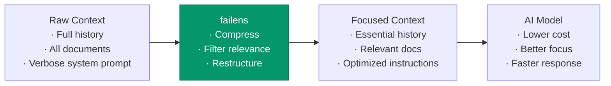
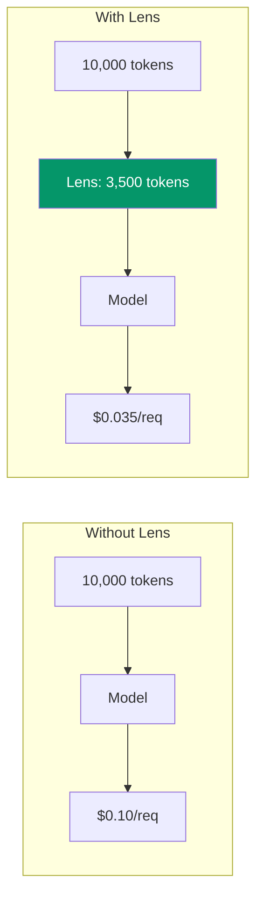
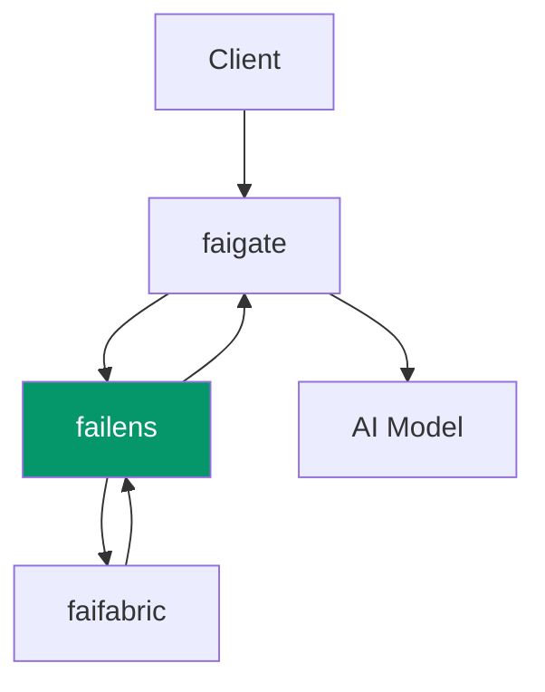

# failens — Context Focusing Layer

**failens** is the relevance, compression, explanation, and context-focusing layer of the fusionAIze stack. It makes context cheaper, more focused, and more understandable — reducing token costs while improving output quality.

---

## What is Lens?

Every AI call consumes context — the messages, documents, and instructions you send to a model. As context grows, so do costs and latency, while model attention dilutes. **Lens** optimizes context before it reaches the model, ensuring the model sees only what matters.



---

## Key Capabilities

### Context Compression

Lens compresses conversation history and long documents while preserving semantic meaning. It uses a hybrid approach — structural summarization combined with semantic compaction:

| Technique | What it does | Best for |
|-----------|-------------|----------|
| **Window trimming** | Drops or truncates old messages | Long conversations |
| **Semantic summarization** | Replaces verbose text with condensed versions | Documentation, transcripts |
| **Token compaction** | Compresses whitespace, removes filler | General use |
| **Incremental compression** | Compresses history at each turn, maintaining a running summary | Multi-turn agents |

```yaml title="lens.yaml — compression config"
compression:
  enabled: true
  strategies:
    - type: "window-trimming"
      params:
        max_turns: 20
        keep_system: true

    - type: "semantic-summarization"
      params:
        model: "gpt-4o-mini"
        target_tokens: 500

    - type: "token-compaction"
      params:
        max_tokens: 8000
```

!!! tip "Cost Impact"
    Lens compression typically reduces input tokens by **30–70%** for long-running conversations and document-heavy prompts, directly translating to lower API costs.

### Relevance Filtering

Not every document in your knowledge base is relevant to every query. Lens scores and filters context before injection:

```yaml
relevance:
  enabled: true
  threshold: 0.7
  max_documents: 5
  strategy: "semantic-similarity"  # or "keyword", "hybrid"
```

**Strategies:**

- **Semantic similarity** — embed query and documents, compare cosine distance
- **Keyword BM25** — classic term-frequency scoring
- **Hybrid** — combines both with configurable weights
- **LLM-as-judge** — uses a fast model to score relevance directly

### Explanation Generation

Lens can explain *why* it included or excluded specific context — critical for debugging and trust:

```json
{
  "query": "How do I configure rate limiting?",
  "context": [
    {
      "document_id": "rate-limiting-config",
      "relevance": 0.94,
      "explanation": "Direct documentation on rate limiting configuration"
    },
    {
      "document_id": "gate-api-keys",
      "relevance": 0.72,
      "explanation": "Covers API key scopes which interact with rate limits"
    },
    {
      "document_id": "deployment-guide",
      "relevance": 0.31,
      "explanation": "Too generic — only peripherally mentions rate limits"
    }
  ],
  "excluded": [
    {
      "document_id": "getting-started",
      "reason": "Below relevance threshold (0.12)"
    }
  ]
}
```

### Context Window Optimization

Lens tracks model context windows and prevents overflow by pre-emptively applying the right optimization strategy. It handles:

- **Token counting** — accurate token counting per model family
- **Overflow prevention** — catches requests that would exceed the context window before they reach the provider
- **Priority-based allocation** — allocates token budget to system prompt → history → documents → instructions, in priority order

```yaml
window_optimization:
  enabled: true
  mode: "auto"  # auto | strict | permissive
  priority_allocation:
    system_prompt: 2000
    conversation_history: 4000
    documents: 3000
    instructions: 1000
    reserve: 500     # Always leave headroom
```

---

## Plugin Architecture

Lens is built on a **plugin system**. Every capability — compression, filtering, explanation, optimization — is a plugin. You can compose them or build your own.

```
plugins/
├── compressors/
│   ├── window-trimmer/
│   ├── semantic-summarizer/
│   ├── token-compactor/
│   └── incremental-compressor/
├── filters/
│   ├── semantic-similarity/
│   ├── keyword-bm25/
│   ├── hybrid-filter/
│   └── llm-judge/
├── explainers/
│   ├── trace-explainer/
│   └── diff-explainer/
└── monitors/
    ├── token-counter/
    └── cost-estimator/
```

### Writing a Custom Plugin

Plugins implement a simple interface:

```python title="custom_compressor.py"
from failens.plugins import CompressorPlugin, Context

class AcronymExpander(CompressorPlugin):
    """Expand industry acronyms for better model understanding."""

    name = "acronym-expander"
    version = "1.0.0"

    ACRONYMS = {
        "RAG": "Retrieval-Augmented Generation",
        "ICM": "In-Context Memory",
    }

    def compress(self, context: Context) -> Context:
        for doc in context.documents:
            for acro, full in self.ACRONYMS.items():
                doc.content = doc.content.replace(
                    acro, f"{acro} ({full})"
                )
        return context
```

Configure in `lens.yaml`:

```yaml
plugins:
  custom:
    - name: "acronym-expander"
      path: "./plugins/acronym_expander.py"
      enabled: true
```

---

## How Lens Reduces Costs

Token costs scale with input length. Lens reduces the effective context size before it reaches the model:

| Scenario | Before Lens | After Lens | Savings |
|----------|------------|------------|---------|
| 30-turn agent conversation | 18,400 tokens | 6,200 tokens | 66% |
| RAG with 20 retrieved documents | 24,800 tokens | 8,100 tokens | 67% |
| Documentation Q&A with full manual | 45,000 tokens | 9,500 tokens | 79% |
| Multi-document comparison | 32,000 tokens | 14,300 tokens | 55% |

*Estimates based on typical usage patterns. Actual savings depend on content and configuration.*



At scale — thousands of requests per day — Lens saves **significant money**.

---

## Integration with Gate and Fabric



| Integration | How it works |
|-------------|-------------|
| **faigate** | Lens sits between Gate and providers. Gate routes requests through Lens before dispatching to models. |
| **faifabric** | Lens queries Fabric for relevant context, then filters and compresses the results. Lens also writes compression summaries back to Fabric as lightweight memory entries. |
| **faios** | OS configures per-team and per-role Lens plugins. Sales teams get document-focused filtering; engineering teams get code-aware compression. |

---

## Quickstart

### 1. Install

```bash
npm install -g @fusionaize/failens

# Docker
docker pull fusionaize/failens:latest
```

### 2. Configure

```yaml title="lens.yaml"
gate:
  url: "http://localhost:8080"

compression:
  enabled: true
  strategies:
    - type: "window-trimming"
      params:
        max_turns: 15
        keep_system: true
    - type: "semantic-summarization"
      params:
        model: "gpt-4o-mini"
        target_tokens: 400

relevance:
  enabled: true
  threshold: 0.65
  max_documents: 8
  strategy: "hybrid"

window_optimization:
  enabled: true
  mode: "auto"

fabric:
  enabled: true
  url: "http://localhost:8081"
```

### 3. Run

```bash
# Start Lens alongside Gate
failens serve --config lens.yaml --gate-url http://localhost:8080

# Lens now intercepts requests through Gate
curl http://localhost:8080/v1/chat/completions \
  -H "Authorization: Bearer fgsk_..." \
  -H "Content-Type: application/json" \
  -H "X-Fusion-Lens: enabled" \
  -d '{
    "model": "gpt-4o",
    "messages": [
      {"role": "system", "content": "You are a helpful assistant.
      [long system prompt...]"},
      {"role": "user", "content": "What is the rate limiting config?
      [large context attachment...]"}
    ]
  }'
```

### 4. Verify

Check Lens is optimizing requests:

```bash
curl http://localhost:8081/health
```

```json
{
  "status": "active",
  "requests_processed": 1247,
  "tokens_saved": 2841000,
  "avg_compression_ratio": 0.61,
  "plugins_active": [
    "window-trimmer",
    "semantic-summarizer",
    "hybrid-filter"
  ]
}
```

---

## Per-Request Control

Clients can control Lens behavior per request via headers:

| Header | Value | Effect |
|--------|-------|--------|
| `X-Fusion-Lens` | `enabled` / `disabled` | Enable or bypass Lens for this request |
| `X-Fusion-Lens-Compress` | `true` / `false` | Enable or disable compression |
| `X-Fusion-Lens-Filter` | `true` / `false` | Enable or disable relevance filtering |
| `X-Fusion-Lens-Threshold` | `0.0–1.0` | Override relevance threshold |
| `X-Fusion-Lens-Max-Docs` | integer | Override max documents |
| `X-Fusion-Lens-Explain` | `true` / `false` | Request explanation trace |
