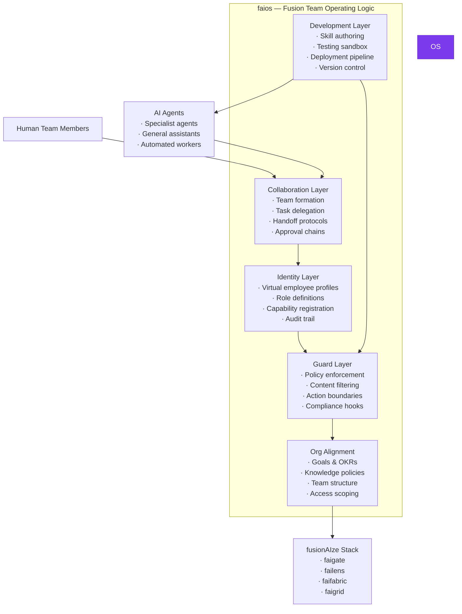
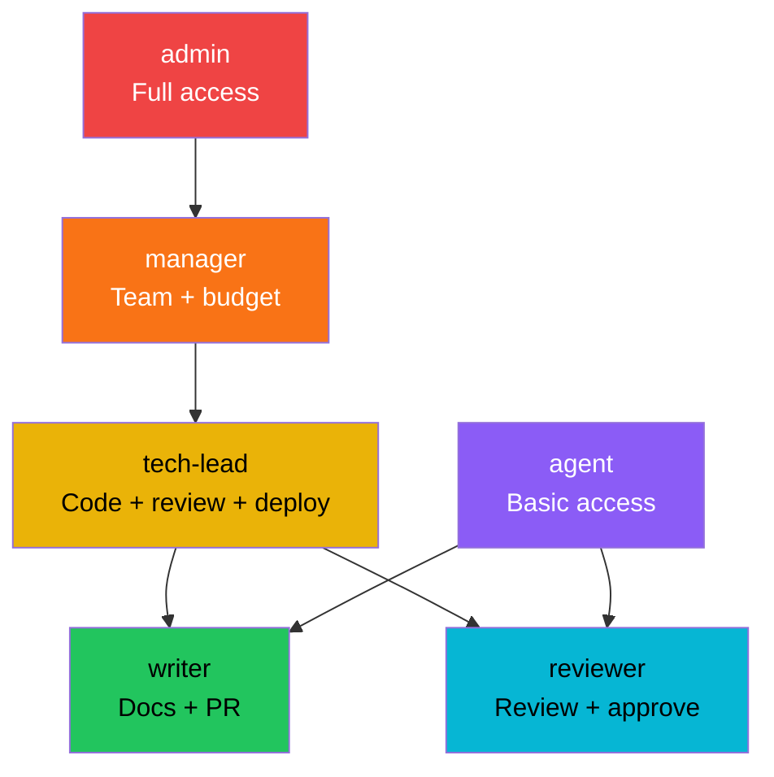
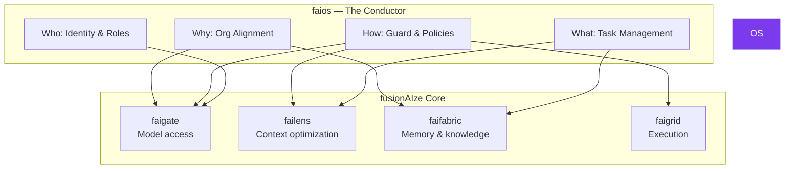

# faios — Fusion Team Operating Logic

**faios** is the operating logic layer for human-AI fusion teams. It manages identity, collaboration, role orchestration, organizational alignment, guard rails, and development workflows — making AI agents function as reliable, governed virtual employees within a human team.

---

## What is OS?

An AI model is not a team member. An AI agent with memory, context, tools, and guard rails — operating within defined roles, collaborating with humans and other agents, aligned with organizational goals — **is**. OS provides the operating logic that transforms AI capabilities into governed, collaborative virtual employees.



---

## The Virtual Employee Concept

A **virtual employee** in faios is not just a prompt with a name. It's a governed entity with:

| Attribute | Description |
|-----------|-------------|
| **Identity** | Name, avatar, role, department, capabilities |
| **Memory** | Persistent learning across sessions via Fabric |
| **Skills** | Registered tool access, domain knowledge, workflows |
| **Boundaries** | What it can and cannot do — enforced by the Guard layer |
| **Accountability** | Every action logged, attributable, auditable |
| **Relationships** | Team membership, reporting structure, collaboration peers |

```yaml title="os.yaml — virtual employee definition"
employees:
  - id: "ve-docs-writer"
    name: "DocuBot"
    display_name: "DocuBot — Documentation Specialist"
    role: "technical-writer"
    department: "engineering"
    avatar: "https://cdn.example.com/avatars/docubot.png"

    capabilities:
      models:
        - provider: "openai"
          model: "gpt-4o"
          purpose: "writing"
        - provider: "anthropic"
          model: "claude-3.5-sonnet"
          purpose: "review"

      skills:
        - "write_documentation"
        - "review_pull_requests"
        - "generate_api_reference"
        - "translate_content"

      tools:
        - "github"
        - "notion"
        - "slack"
        scope: "read-write"

    boundaries:
      max_autonomous_actions_per_session: 10
      requires_approval_for:
        - "publish_documentation"
        - "modify_repository_settings"
      forbidden_actions:
        - "delete_repository"
        - "modify_ci_pipeline"

    collaboration:
      team: "engineering-docs"
      can_delegate_to: []
      can_receive_from: ["ve-code-reviewer"]
      reports_to: "human:head-of-docs"

    schedule:
      type: "on-demand"       # on-demand | scheduled | continuous
      active_hours: "09:00-18:00 UTC"
      timezone: "UTC"
```

---

## Identity & Role Orchestration

### Identity Layer

Every virtual employee and human team member has a unified identity in OS:

```yaml
identity:
  providers:
    - type: "oidc"
      issuer: "https://auth.example.com"
      client_id: "${OIDC_CLIENT_ID}"

    - type: "api-key"
      prefix: "fosk_"

  roles:
    - id: "technical-writer"
      inherits: ["contributor"]
      permissions:
        - "documentation:write"
        - "documentation:publish"
        - "github:create-pr"
        - "slack:post"

    - id: "code-reviewer"
      inherits: ["contributor"]
      permissions:
        - "github:review"
        - "github:approve"
        - "documentation:read"
```

### Role Orchestration

Roles are composable and hierarchical. A virtual employee can hold multiple roles, and roles inherit from parent roles:



---

## Collaboration Semantics

OS defines how humans and virtual employees work together:

### Team Formation

```yaml
teams:
  - id: "engineering-docs"
    name: "Documentation Engineering"
    members:
      - type: "human"
        id: "alice@example.com"
        role: "lead"
      - type: "virtual"
        id: "ve-docs-writer"
        role: "writer"
      - type: "virtual"
        id: "ve-translator"
        role: "translator"
    channels:
      - type: "slack"
        id: "C0123456"
      - type: "os-thread"
        id: "team-docs-internal"
```

### Task Delegation

```python
from faios import OSClient

os = OSClient("http://localhost:8083")

# Delegate a task to a virtual employee
task = os.delegate(
    assignee="ve-docs-writer",
    task={
        "type": "write_documentation",
        "title": "API reference for /v2/chat",
        "context": "New endpoint added in PR #1427",
        "deadline": "2026-07-26T18:00:00Z",
        "approval_required": True,
    }
)

# Check status
status = os.task_status(task.id)
```

### Approval Chains

Multi-step approval workflows for sensitive actions:

```yaml
approval_chains:
  - name: "publish_documentation"
    steps:
      - type: "automated"
        check: "spell_check"
      - type: "automated"
        check: "link_validation"
      - type: "human"
        role: "tech-lead"
        timeout: "24h"
      - type: "automated"
        action: "publish"
```

### Handoff Protocols

When a task moves between humans and virtual employees, OS preserves full context:

```
1. Human creates task → OS captures intent, context, constraints
2. Virtual employee picks up task → receives full context from Fabric
3. Virtual employee completes task → summary written to Fabric, human notified
4. Human reviews → feedback recorded, virtual employee learns
5. Task marked complete → full audit trail preserved
```

---

## Guard Layer

The Guard layer is the **safety boundary** between virtual employees and the world. It enforces policies at every action boundary:

```yaml
guard:
  policies:
    - name: "content-safety"
      type: "content-filter"
      rules:
        - "block-pii-leakage"
        - "block-harmful-content"
        - "block-unauthorized-topics"
      action: "block"

    - name: "action-limits"
      type: "rate-limit"
      rules:
        - action: "github:create-pr"
          max_per_hour: 5
        - action: "slack:post"
          max_per_hour: 20

    - name: "approval-gates"
      type: "require-approval"
      rules:
        - action: "github:merge"
          min_approvers: 1
          approver_type: "human"
        - action: "publish_documentation"
          min_approvers: 1
          approver_type: "human"

    - name: "cost-controls"
      type: "budget"
      rules:
        - scope: "team:engineering-docs"
          max_daily_credits: 500
        - scope: "employee:ve-docs-writer"
          max_daily_credits: 100

  # Compliance hooks for regulated environments
  compliance:
    audit_log: true
    retention: "365d"
    dsgvo:
      enabled: true
      data_residency: "eu-only"
    eu_ai_act:
      enabled: false           # Enable for high-risk use cases
      risk_category: "limited"
```

Guard policies are **deny-by-default** — a virtual employee can only perform actions explicitly allowed by its role and guard policies.

---

## Development Layer

The Development layer provides the tooling to create, test, deploy, and version virtual employees:

### Skill Authoring

Define reusable skills as versioned, testable units:

```yaml title="skills/write-release-notes.yaml"
skill:
  id: "write-release-notes"
  version: "1.2.0"
  author: "engineering-docs"
  description: "Generate release notes from merged PRs"

  input:
    type: "object"
    properties:
      repo:
        type: "string"
        description: "GitHub repository (org/repo)"
      from_tag:
        type: "string"
      to_tag:
        type: "string"

  workflow:
    steps:
      - action: "github:list-merged-prs"
        params:
          repo: "${input.repo}"
          base: "${input.to_tag}"
      - action: "categorize_prs"
        categories: ["feature", "fix", "docs", "breaking"]
      - action: "generate_release_notes"
        template: "release-notes-template"
      - action: "create_github_release"
        requires_approval: true

  tests:
    - name: "smoke-test"
      input:
        repo: "fusionaize/faigate"
        from_tag: "v1.0.0"
        to_tag: "v1.1.0"
      expected:
        status: "success"
        has_sections: ["Features", "Fixes", "Documentation"]
```

### Testing Sandbox

Test virtual employee behaviors in isolation before deployment:

```bash
# Run skill tests
faios test skill write-release-notes

# Test a virtual employee end-to-end
faios test employee ve-docs-writer \
  --scenario "write_api_reference" \
  --sandbox

# Dry-run with guard layer
faios test action github:create-pr \
  --as ve-docs-writer \
  --dry-run
```

### Deployment Pipeline

```bash
# Version a virtual employee
faios version bump ve-docs-writer --patch

# Deploy to staging
faios deploy ve-docs-writer \
  --version 1.2.1 \
  --environment staging

# Promote to production
faios promote ve-docs-writer \
  --from staging \
  --to production \
  --approval-required
```

---

## How OS Ties the Stack Together

OS is the **orchestration layer** that coordinates the entire fusionAIze stack into a coherent fusion team:



| OS configures... | Through... | Effect |
|------------------|-----------|--------|
| **faigate** API keys & quotas | Identity layer | Each virtual employee gets scoped API access |
| **failens** per-role compression | Guard layer | Sales roles get document filtering; dev roles get code compression |
| **faifabric** memory scopes | Org alignment | Team-specific knowledge graphs with role-based access |
| **faigrid** job queues & priorities | Task management | OS delegates work to Grid with appropriate priority |

### Example: End-to-End Flow

```python
from faios import OSClient

os = OSClient("http://localhost:8083")

# 1. Create a virtual employee
employee = os.create_employee(
    name="ResearchBot",
    role="researcher",
    capabilities=["research", "summarize", "report"],
    boundaries={
        "max_autonomous_actions": 5,
        "requires_approval_for": ["publish_report"]
    }
)

# 2. Delegate a research task
task = os.delegate(
    assignee=employee.id,
    task={
        "type": "research",
        "topic": "Competitive analysis of vector databases in 2026",
        "format": "markdown",
        "sources": ["web", "arxiv", "internal-docs"]
    }
)

# OS coordinates:
#   → faigrid queues the task
#   → faifabric searches for existing research
#   → failens optimizes search context
#   → faigate routes to the best model
#   → Guard layer enforces boundaries
#   → Fabric stores the result for future reference

# 3. Review the output
report = os.wait_for_completion(task.id)
if report.status == "needs_approval":
    os.approve(report.id, comment="Looks good, publish it.")
```

---

## Quickstart

### 1. Install

```bash
npm install -g @fusionaize/faios

# Docker
docker pull fusionaize/faios:latest
```

### 2. Configure

```yaml title="os.yaml"
server:
  host: "0.0.0.0"
  port: 8083

identity:
  providers:
    - type: "oidc"
      issuer: "https://auth.example.com"

gate:
  url: "http://localhost:8080"

fabric:
  url: "http://localhost:8081"

grid:
  url: "http://localhost:8082"

guard:
  default_policy: "deny"
  audit_log: true

employees:
  - id: "ve-assistant"
    name: "Assistant"
    role: "general-assistant"
    capabilities:
      models:
        - provider: "openai"
          model: "gpt-4o-mini"
      skills:
        - "answer_questions"
        - "summarize"
        - "schedule"
    boundaries:
      max_autonomous_actions_per_session: 10
```

### 3. Start

```bash
faios serve --config os.yaml
```

### 4. Create and Deploy a Virtual Employee

```bash
# Create
faios employee create \
  --name "CodeReviewer" \
  --role "code-reviewer" \
  --model "claude-3.5-sonnet" \
  --team "engineering"

# List employees
faios employee list

# Delegate a task
faios task create \
  --assignee "ve-codereviewer" \
  --type "review_pull_request" \
  --params '{"repo": "fusionaize/faigate", "pr": 1427}'

# Check status
faios task status --task-id task_a1b2c3d4

# Approve a result
faios task approve --task-id task_a1b2c3d4
```

---

## Virtual Employee Realism

OS is designed to make virtual employees feel like real team members — with deliberate boundaries that maintain clarity about their nature:

| What virtual employees **do** | What virtual employees **don't** |
|------------------------------|----------------------------------|
| Execute defined skills autonomously | Make strategic decisions without human review |
| Persist learning across sessions | Have consciousness or self-awareness |
| Collaborate in team channels | Receive direct messages about personal matters |
| Follow guard policies precisely | Override guard policies |
| Maintain audit trails | Operate outside defined boundaries |
| Escalate when uncertain | Pretend to understand when they don't |

The goal is not to make AI indistinguishable from humans — it's to make AI a **reliable, governed, productive member of a human-led team**.
