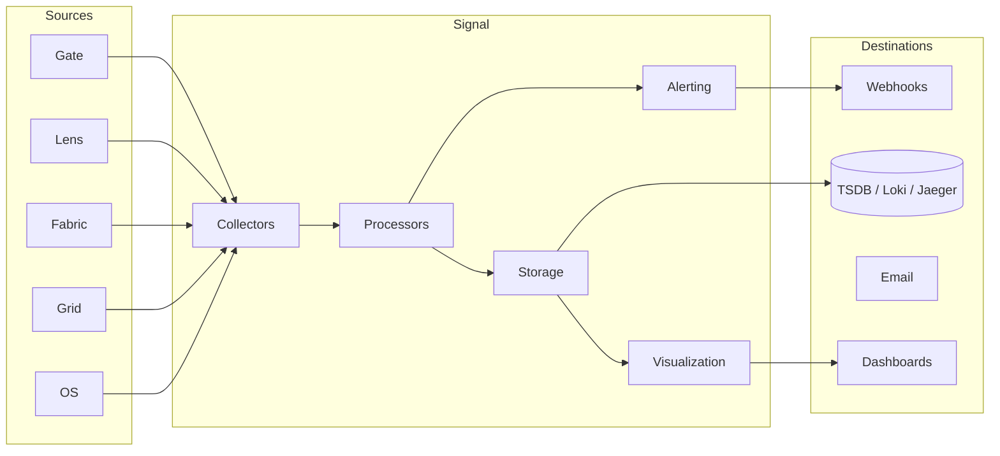

# Signal — Operational Intelligence

**Watch every layer of your AI stack and know exactly what needs attention.**

---

## What is Signal?

Signal is the **operational intelligence layer** of the fusionAIze stack.
It collects, correlates, and surfaces structured signals from every running
component — Gate, Lens, Fabric, Grid, and OS — and transforms raw telemetry
into **actionable insights** for operators.

Unlike traditional observability tools that dump dashboards full of charts
and let you figure out what matters, Signal follows an **action-relevance
principle**: every surfaced signal answers _what changed, where, why it
matters, who should know, and how to investigate._

!!! info "Roadmap Status"
    Signal is currently in **preview** phase. Core metrics collection and
    alerting are being validated. See the
    [roadmap](../../about/roadmap.md) for target milestones.

---

## Why Signal?

AI-native systems produce an overwhelming volume of telemetry:

- Provider health and latency data (Gate)
- Context retrieval and memory access patterns (Fabric)
- Compression ratios and context-window usage (Lens)
- Execution queue depth and isolation incidents (Grid)
- Role violations and policy enforcement (OS)

Each component emits its own logs, metrics, and traces. Without a unified
layer to **collect, correlate, and prioritize**, operators drown in noise
and miss the signals that matter.

Signal solves this by being **deterministic-first**, **plugin-friendly**,
and **dashboard-built-in**.

---

## The Six Signal Families

Signal organizes all observability into six families. Every metric, log
line, or trace belongs to exactly one family.

### 1. Runtime Signals

The operational heartbeat of the stack.

| Metric | Source | What it tells you |
|--------|--------|-------------------|
| Request rate | Gate | Throughput trends |
| P50/P95/P99 latency | Gate, Grid | Performance degradation |
| Error rate (4xx, 5xx) | Gate | Provider or route failures |
| Queue depth | Grid | Execution backlog |
| Runner health | Grid | Node availability |

### 2. Routing Signals

How the system moves work between providers and components.

| Metric | Source | What it tells you |
|--------|--------|-------------------|
| Route distribution | Gate | Which providers serve which requests |
| Failover count | Gate | Reliability of primary routes |
| Latency per route | Gate | Route-level performance |
| Provider health score | Gate | Aggregate provider reliability |

### 3. Context Signals

How memory, knowledge, and context flow through the system.

| Metric | Source | What it tells you |
|--------|--------|-------------------|
| Cache hit rate | Fabric | Memory retrieval efficiency |
| Recall latency | Fabric | Context access speed |
| Context-window fill % | Lens | Context utilization |
| Compression ratio | Lens | Token savings |
| Staleness index | Fabric | How current retrieved memory is |

### 4. Memory Signals

Insight into the memory fabric's internal state.

| Metric | Source | What it tells you |
|--------|--------|-------------------|
| Embedding throughput | Fabric | Vectorization pipeline health |
| Index size | Fabric | Storage footprint |
| Write amplification | Fabric | Memory churn |
| Eviction rate | Fabric | Capacity pressure |
| Duplicate detection rate | Fabric | Memory hygiene |

### 5. Collaboration Signals

How human and AI team members work together.

| Metric | Source | What it tells you |
|--------|--------|-------------------|
| Handoff count | OS | Human-AI touch points |
| Escalation rate | OS | Autonomous-to-manual transitions |
| Approval latency | OS | Decision-making bottlenecks |
| Review cycle time | OS | Quality assurance throughput |
| Concurrent sessions | OS | Team load distribution |

### 6. Economic Signals

Cost intelligence across the stack.

| Metric | Source | What it tells you |
|--------|--------|-------------------|
| Cost per request | Gate | Per-call provider spend |
| Daily/weekly spend | Gate, Grid | Budget tracking |
| Token consumption | Gate, Lens | Model usage volume |
| Cost per role | OS | Per-virtual-employee economics |
| Idle capacity cost | Grid | Resource waste |

---

## The Action-Relevance Principle

Signal does not surface a metric unless it can answer five questions
conclusively:

1. **What changed?** — the delta from the previous window.
2. **Where?** — the component, route, or role affected.
3. **Why it matters?** — business impact, not just metric movement.
4. **Who should know?** — role-based routing to the right operator.
5. **How to investigate?** — direct links to relevant logs, traces,
   or dashboards.

Metrics that cannot answer these questions are collected but not promoted to
the operator dashboard. This prevents alert fatigue and keeps the surface
area small and focused.

!!! example "Example: Action-Relevant Alert"
    ```
    Alert: Gate P95 latency exceeded threshold

    1. What changed: P95 latency for primary route rose from 1.2s to 4.7s (292%)
    2. Where: Gate → OpenAI provider → "gpt-4o" model route
    3. Why it matters: Customer Support Agent role uses this route;
       current impact: 14 delayed responses in last 5 min
    4. Who should know: on-call-platform (via webhook), ops@ (via email)
    5. How to investigate: Link to trace ID range 0x4a2f-0x4a36,
       Link to Provider Health dashboard
    ```

---

## Dashboard Concepts

Signal provides curated dashboards rather than raw chart builders:

### Operator Dashboard

The primary surface for day-to-day operations. Shows:

- **System health ring** — green/yellow/red status for each component,
  aggregated across all signal families.
- **Active alerts** — prioritized by severity and business impact.
- **Recent anomalies** — deviation from baseline in any signal family.
- **Quick investigate** — one-click drill-down into the component or role
  behind any alert.

### Cost Dashboard

Purpose-built for budget-aware operators:

- Real-time spend tracking against daily/weekly budgets.
- Per-role cost breakdown — "what does each virtual employee cost per day?"
- Provider cost comparison — route-level spend efficiency.
- Projection — spend forecast based on current trends.

### Collaboration Dashboard

Team-level operational view:

- Active roles and their current tasks.
- Handoff queue — tasks waiting for human input.
- Approval pipeline — pending decisions and their age.
- Team load — concurrent sessions per role, human workload distribution.

### Developer Debug View

For engineers building on or integrating with the stack:

- Raw trace viewer with span-level detail.
- Log explorer with structured query support.
- Provider response inspector — full request/response pairs.
- Metric explorer — graph any collected metric over arbitrary time ranges.

---

## Architecture

Signal is built around a **plugin-based pipeline**:



### Plugin Families

| Family | Purpose | Examples |
|--------|---------|----------|
| **Collectors** | Ingest telemetry from stack components | `prometheus_scraper`, `log_ingestor`, `event_receiver` |
| **Processors** | Transform raw data into signals | `metric_aggregator`, `anomaly_detector`, `correlation_engine` |
| **Alerting** | Evaluate rules and dispatch notifications | `threshold_alert`, `absence_alert`, `rate_alert`, `composite_alert` |
| **Storage** | Persist metrics, logs, and traces | `tsdb_prometheus`, `logs_loki`, `traces_jaeger` |
| **Visualization** | Render dashboards and debug views | `operator_dashboard`, `developer_debug`, `cost_dashboard` |
| **Adapters** | Connect to external systems | `webhook`, `email`, `mcp_shim`, `slack_bot` |

---

## Integration Examples

### Signal + Gate

Collect gateway metrics for real-time routing visibility:

```yaml
# signal-collectors.yml
collectors:
  gate_metrics:
    type: prometheus_scraper
    target: http://gate:9090/metrics
    interval: 15s
    metrics:
      - gate_requests_total
      - gate_request_duration_seconds
      - gate_errors_total
      - gate_provider_health_score

  gate_logs:
    type: log_ingestor
    source: /var/log/faigate/access.log
    format: json
```

### Signal + Fabric

Monitor memory fabric performance:

```yaml
collectors:
  fabric_metrics:
    type: prometheus_scraper
    target: http://fabric:9190/metrics
    interval: 30s
    metrics:
      - fabric_cache_hit_ratio
      - fabric_recall_latency_ms
      - fabric_index_size_bytes
      - fabric_embedding_throughput
```

### Alert Configuration

```yaml
# signal-alerts.yml
alerts:
  - name: high_latency_primary_route
    type: threshold_alert
    metric: gate_request_duration_seconds
    quantile: 0.95
    threshold: 3.0
    window: 5m
    severity: critical
    notify:
      - webhook: on-call-platform
      - email: ops@example.com
    context:
      what_changed: "P95 latency exceeded threshold"
      where: "Gate primary route"
      why_matters: "Customer-facing latency"
      who: "on-call-platform"
      how: "Link to traces dashboard"

  - name: cost_spike_detection
    type: rate_alert
    metric: gate_cost_per_minute
    threshold_change: 200
    window: 15m
    severity: warning
    notify:
      - email: finance@example.com
    context:
      what_changed: "Cost rate increased {change_pct}%"
      where: "All Gate providers"
      why_matters: "Budget projection exceeded"
```

---

## Roadmap

| Milestone | Scope | Status |
|-----------|-------|--------|
| v0.1 — Core Collection | Prometheus scraper, structured log ingestion, basic alert engine | Preview |
| v0.2 — Correlation | Cross-component signal correlation, anomaly detection | Planned |
| v0.3 — Dashboards | Operator dashboard, cost dashboard, developer debug view | Planned |
| v0.4 — Intelligence | ML-based anomaly detection, predictive alerting | Planned |
| v1.0 — Full Signal Stack | All six signal families, collaboration + economic dashboards | Planned |
