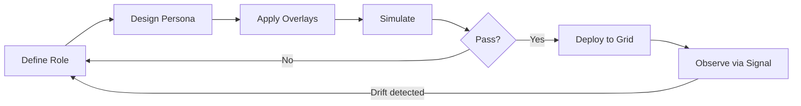
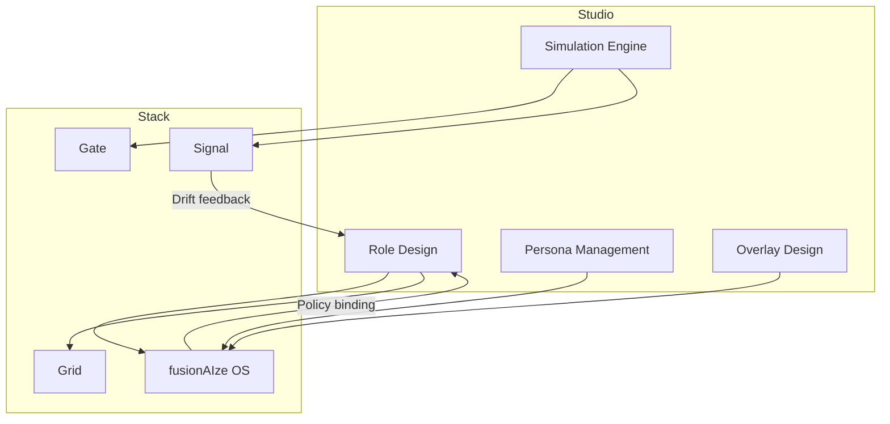

# Studio — Blueprint Authoring

**Plan and design virtual employees before they go live.**

---

## What is Studio?

Studio is the **blueprint authoring and simulation environment** for virtual
employees in the fusionAIze stack. Before a virtual employee runs on Grid and
interacts through Gate, an operator uses Studio to define its **role**, design
its **persona**, wire up its **tool access**, and simulate its behavior against
real or synthetic workloads.

Think of Studio as the staging environment for AI-native team members —
where you prototype, compare, and refine before deploying to production.

!!! info "Roadmap Status"
    Studio is currently in **design and preview** phase. The API surface, UI
    patterns, and storage format are being validated before implementation.
    See the [roadmap](../../about/roadmap.md) for target milestones.

---

## Why Studio?

Deploying virtual employees without upfront design leads to three common
failure modes:

1. **Role drift** — the employee does things outside its intended scope
   because constraints were never formally defined.
2. **Personality mismatch** — the tone, style, and interaction patterns
   clash with the human team's culture.
3. **Tool sprawl** — access is granted by default, not by need, creating
   security and cost risks.

Studio addresses each of these by making role definition a **first-class
design activity** with validation, simulation, and comparison built in.

---

## Key Capabilities

### Role Design

Define what a virtual employee **is** and what they **can do**:

- **Role specification** — name, purpose, domain, and scope of authority.
- **Capability inventory** — which Gate providers and tools the role may
  invoke, and under what conditions.
- **Policy binding** — link the role to OS-level policies for audit,
  rate-limiting, and escalation.
- **Constraint language** — declarative rules for what the role must never
  do (e.g., "never send email without human approval").

```
role:
  name: Customer Success Agent
  domain: post-purchase support
  authority: autonomous_with_escalation
  constraints:
    - never_access: [billing_api, refund_api]
    - require_approval: [email_to_customer]
    - rate_limit: 10_rpm
```

### Persona Management

Design the **voice, tone, and interaction style** of virtual employees:

- **Tone profiles** — predefined tonal ranges (formal, casual, empathetic,
  technical) with per-channel variants.
- **Interaction scripts** — common conversational patterns and escalation
  phrases that maintain brand consistency.
- **Cultural alignment** — locale-aware defaults for language, formality,
  and communication norms.
- **Persona testing** — quick chat-based rehearsals to validate that the
  persona reads naturally.

### Overlay Design

Overlays are **situational modifications** that change how a virtual employee
behaves under specific conditions:

- **Time-based overlays** — different behavior during business hours vs.
  after-hours.
- **Role-based overlays** — escalate formality when interacting with
  executives vs. peers.
- **Emergency overlays** — tighten constraints and switch to minimal-safe
  mode during incidents.

Overlays compose non-destructively on top of the base role, so the core
persona remains stable while behavior adapts contextually.

### Diff, Compare & Simulation

Before a role goes live, validate it:

- **Diff mode** — compare two versions of a role definition side-by-side.
  Every constraint, persona parameter, and tool binding is diffable.
- **A/B simulation** — run the same task through two role variants and
  compare outputs across quality, cost, latency, and constraint adherence.
- **Stress testing** — bombard a role with edge-case inputs to find gaps in
  constraint coverage.
- **Regression suites** — replay historical interactions against updated
  role definitions to catch regressions.



### Role Realism Scoring

Studio computes a **realism score** that quantifies how well a virtual
employee would integrate into a human team:

| Dimension | What it measures |
|-----------|-----------------|
| Constraint coverage | Fraction of dangerous operations explicitly blocked |
| Persona consistency | Internal coherence of tone, language, and behavior |
| Tool necessity | Ratio of needed to granted tool access |
| Escalation hygiene | Proper handling of out-of-scope requests |
| Cultural fit | Alignment with team communication norms |

This score is visible during design and becomes a **deployment gate** — roles
below a threshold cannot be promoted to production.

---

## Target Users

### Agencies

Agencies designing virtual employees for multiple clients benefit from:

- **Reusable role templates** — define a "Customer Service Agent" once,
  customize per client via overlays.
- **Client-side preview** — let clients interact with a simulated employee
  before signing off.
- **Multi-tenant role isolation** — each client's roles, personas, and
  constraints are fully segregated.

### Enterprise

Large organizations need governance around AI-native team members:

- **Role approval workflows** — manager sign-off before a role goes live.
- **Compliance audit trail** — every role change is versioned and logged.
- **Policy inheritance** — roles inherit org-wide constraints (e.g., "no PII
  in logs") and add role-specific ones.

---

## Interaction with Other Components



- **OS** stores roles, policies, and identities. Studio reads and writes
  role definitions through OS APIs.
- **Grid** receives compiled role blueprints that define execution
  boundaries and constraints.
- **Gate** routes simulation traffic to providers during testing.
- **Signal** feeds runtime behavioral data back into Studio for drift
  detection and role refinement.

---

## Roadmap

| Milestone | Scope | Status |
|-----------|-------|--------|
| v0.1 — Role Spec | JSON/YAML role definition format, constraint validation | Design |
| v0.2 — Persona Editor | Tone profiles, interaction scripts, chat-based preview | Planned |
| v0.3 — Simulation Mode | A/B runs, stress testing, regression suites | Planned |
| v0.4 — Diff & Compare | Visual diffing of role versions, semantic change detection | Planned |
| v1.0 — Deployment | Role promotion to Grid, policy binding via OS, Signal feedback loop | Planned |
